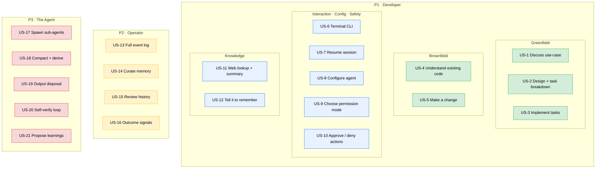

# Requirements — codingAgent

> Working name: **codingAgent** (final product name deferred — see `design-progress.md` § 2).
> This document holds all of Phase 1. Sub-phases land in order: **1a** personas + user stories (this draft) → **1b** EARS acceptance criteria → **1c** numeric NFRs.

---

## Phase 1a — Personas & User Stories

### What this product is (one paragraph, for orientation only)

An LLM-based coding agent: a **local terminal CLI**, written in **Java**, that talks to models on **AWS Bedrock** and drives a tool-using loop to read, write, and verify code. It has two playbooks over one engine — **greenfield** (discuss → requirements → design → tasks → implement) and **brownfield** (understand existing code → make changes) — and is built to survive long real-world work through sub-agents, conversation persistence/resume, and a curated memory of learnings. *(Mechanisms are deliberately absent here; they live in Phase 2.)*

### Personas

| ID | Persona | Description |
|----|---------|-------------|
| **P1** | **Developer** | A software engineer who runs the CLI against a local repository to build new code (greenfield) or change existing code (brownfield). The primary user; cares about correct, reviewable results that fit their project and respect their machine. |
| **P2** | **Operator** | The person — often the same engineer wearing a different hat — who inspects the agent *after the fact*: reads logs, curates memory, reviews past sessions, and tracks whether the agent is improving. This persona exists because of the observability and memory-curation requirements. |
| **P3** | **The Agent** | The autonomous actor itself, modeled as a first-class persona so its **self-management** behaviours — spawning sub-agents, compacting context, proposing learnings, disposing of large outputs, self-verifying via build tools — are captured as explicit requirements instead of buried as side-effects. These behaviours have no direct human trigger; they emerge from the agent operating. |

### User stories

#### P1 · Developer — Greenfield (core value)

| ID | Story |
|----|-------|
| **US-1** | As a developer, I want to start a brand-new project by discussing my use-case with the agent, so that I can shape requirements before any code is written. |
| **US-2** | As a developer, I want the agent to turn the agreed requirements into a design and a breakdown of discrete tasks, so that implementation proceeds in reviewable increments. |
| **US-3** | As a developer, I want the agent to implement the planned tasks one at a time, so that I can verify progress incrementally rather than receiving one large drop. |

#### P1 · Developer — Brownfield (core value)

| ID | Story |
|----|-------|
| **US-4** | As a developer, I want the agent to explore and understand my existing codebase, so that its changes fit the structure and conventions already there. |
| **US-5** | As a developer, I want to ask the agent to make a specific change to existing code, so that it edits the right files correctly without me locating them by hand. |

#### P1 · Developer — Interaction, Configuration & Safety

| ID | Story |
|----|-------|
| **US-6** | As a developer, I want to drive the agent from a terminal CLI against my local repository, so that it fits my existing workflow with no extra infrastructure. |
| **US-7** | As a developer, I want to resume a previous session and continue where I left off, so that a task can span multiple sittings. |
| **US-8** | As a developer, I want to configure which model the agent uses, its permission mode, and my project's build/test commands, so that it behaves appropriately for my project. |
| **US-9** | As a developer, I want to choose how much autonomy the agent has — from read-only, through approve-each-action, to fully unrestricted — so that I can match its freedom to my risk tolerance. |
| **US-10** | As a developer, I want to approve or deny the commands and file-writes the agent proposes (in the asking modes), so that I stay in control of what executes on my machine. |

#### P1 · Developer — Knowledge

| ID | Story |
|----|-------|
| **US-11** | As a developer, I want the agent to look up current information from the web and summarize it when its own knowledge is insufficient, so that it isn't limited to its training cut-off. |
| **US-12** | As a developer, I want to explicitly tell the agent to remember a fact or preference, so that it applies it in future sessions without me repeating myself. |

#### P2 · Operator — Observability & Curation

| ID | Story |
|----|-------|
| **US-13** | As an operator, I want a complete log of everything the agent did — prompts, model responses, thinking, tool calls, and their results — so that I can debug its behaviour and improve it. |
| **US-14** | As an operator, I want to inspect, edit, and delete the agent's stored memory, so that I can correct or remove a bad learning before it misleads future sessions. |
| **US-15** | As an operator, I want to review past conversations, including archived/compacted ones, so that I can understand how the agent reached a given result. |
| **US-16** | As an operator, I want success/failure and effort signals captured per task, so that I can measure whether the agent is improving over time. |

#### P3 · The Agent — Autonomous self-management

| ID        | Story                                                                                                                                                                                        |
| --------- | -------------------------------------------------------------------------------------------------------------------------------------------------------------------------------------------- |
| **US-17** | As the agent, I want to spawn one or more scoped sub-agents for well-defined subtasks, so that I can complete large work without exhausting my own context window.                           |
| **US-18** | As the agent, I want to compact a long conversation into a fresh derived one as it nears the context limit — preserving the original — so that I can keep working without losing the thread. |
| **US-19** | As the agent, I want to keep large tool and command outputs from overwhelming my context, so that I stay effective even on verbose build and test output.                                    |
| **US-20** | As the agent, I want to verify my changes by running the project's build/test commands and reacting to the results, so that I converge on code that actually compiles and passes.            |
| **US-21** | As the agent, I want to propose a durable learning (for the developer's approval) when I discover something worth remembering, so that I don't repeat the same mistake later.                |

### Story map

**Legend** — 🟩 core value (the coding capabilities the tool exists for) · 🟦 developer-facing enablers · 🟨 operator-facing operational · 🟥 agent autonomous self-management.

### Out of scope (v1) — with destinations

| Excluded from v1 | Destination |
|------------------|-------------|
| AST / JDT / LSP static code analysis | **Dropped** — build tools are ground truth. Future-work *if* symbol-precision ever proves necessary. |
| Reinforcement-learning *training* (reward model, DPO, fine-tuning, weight updates) | **Future-work** (RL ladder rungs 4–5). v1 stops at curated memory + outcome capture. |
| Auto-extraction of memory without human approval | **Deferred** to a later stage. v1 = explicit + agent-proposed-and-approved. |
| Embeddings / RAG / vector retrieval (for code or memory) | **Future-work** (memory retrieval rung 3). v1 = index + selective load. |
| Multi-user / shared service / long-running daemon | **Future-work**. v1 = single-user local CLI. |
| Non-Java code-generation *targets* | **Future-work** — core is language-agnostic; a Java/Maven config ships first. |
| Non-Bedrock model providers (OpenAI, Anthropic direct, local models) | **Future-work**. v1 = AWS Bedrock only. |
| IDE plugin / GUI / web front-end | **Future-work**. v1 = terminal CLI only. |
| MCP-compatible tool registry | **Future-work**. |
| Container / Docker sandboxing | **Future-work**. v1 safety surface = permission gate. |
| Streaming / background execution of long-running commands | **Future-work**. v1 = synchronous capture with timeout. |
| Brazil packaging | **Future-work**. v1 = Maven + open-source GitHub. |

---

## Phase 1b — EARS Acceptance Criteria

Every criterion uses one EARS template, tagged in the **Type** column:
**U** ubiquitous (`The system shall …`) · **Ev** event-driven (`When <trigger>, the system shall …`) · **St** state-driven (`While <state>, the system shall …`) · **Un** unwanted (`If <condition>, then the system shall …`) · **Op** optional (`Where <feature>, the system shall …`).

Numeric thresholds are **symbolic `NFR-*`** here and pinned in 1c. "The agent" = the codingAgent CLI process (and its sub-agents).

### Resolved behavioral defaults (RD-*)

Decisions pinned so the criteria below are concrete and testable. Carried into `design-progress.md` § 3.

| ID | Question | Resolution |
|----|----------|------------|
| **RD-1** | `ASK_ONCE_THEN_REMEMBER` match semantics | **Tool + normalized command prefix** — approving `mvn test` remembers `mvn *`; approving `git status` remembers `git *`. File-writes remembered **per directory subtree**. *(User-selected.)* |
| **RD-2** | Destructive-command carve-out | A configurable **destructive-command denylist** always prompts (even in `UNRESTRICTED`), is **never** auto-approved by a remembered grant, and is **denied outright in `READ_ONLY`**. Seed list: `rm`/`rmdir`, `mv` over an existing target, `dd`, `truncate`, `git push --force`, `git reset --hard`, `git clean -fdx`, output-redirect overwrite (`>`). Full list pinned in the Phase-2 permission ADR. |
| **RD-3** | Default permission mode | `ASK_EVERY_TIME` (= `NFR-PERMISSION-DEFAULT`). |
| **RD-4** | Operation gating taxonomy | **Class R** (read, grep, glob, list) — auto-approved in **all** modes. **Class X** (file write/edit, `run_command` incl. build/test, web-lookup delegate, sub-agent spawn) — gated per mode. |
| **RD-5** | Remembered-grant scope | Scoped to the **session and its compaction-derived lineage**. **Not** persisted across separate sessions; **not** inherited by sub-agents. |
| **RD-6** | Web-lookup under `READ_ONLY` | Web-lookup is **Class X** → **denied in `READ_ONLY`** (it spawns an external subprocess with cost/network). Use an asking mode to allow lookups. **⚠ flagged for pushback.** |
| **RD-7** | Greenfield artifact persistence | Greenfield persists **requirements, design, and task-breakdown as markdown** in the target project, with developer approval gates between stages. Exact template/rigor pinned in Phase 2. |
| **RD-8** | Compaction preserves original | The original conversation is **never deleted** on compaction — archived and linked (`derived-from`). |
| **RD-9** | Memory store form | Human-readable **markdown per entry + index**, two tiers (global, project), hand-editable/deletable, **re-read fresh** on each load. |
| **RD-10** | Verification success signal | **Zero exit** from the configured **test** command = success for the unit of work. |
| **RD-11** | AWS credential resolution | **Named-profile-first with fallback.** If an AWS profile name is configured, resolve Bedrock credentials from it; if that profile is **not found**, fall back to the **AWS default credential provider chain** (env vars → SSO/SDK cache → instance/container role). Only if neither yields usable credentials does the agent fail (exit `4`). *(User-directed.)* |

### CLI exit-code / failure-category contract (seed)

The agent is a CLI, so it has a failure-to-caller surface. This is a **seed**; the authoritative contract is formalized in Phase 3 (`06-formal/cli-exit-codes.md`).

| Code | Category | Meaning |
|------|----------|---------|
| `0` | success | Requested work completed (or interactive session exited cleanly). |
| `1` | internal-error | Unexpected/unhandled error. |
| `2` | usage-config | Bad arguments or invalid/missing configuration (see AC-6.4, AC-8.5). |
| `3` | user-aborted | A required action was denied by the user, blocking progress (see AC-10.2). |
| `4` | model-backend | Bedrock unavailable, auth failure, or retry budget exhausted (`NFR-BEDROCK-MAX-RETRIES`). |
| `5` | context-exhausted | Context limit hit and compaction could not recover. |
| `130` | interrupted | Terminated by SIGINT (Ctrl-C). |

### Acceptance criteria by user story

#### US-1 — Discuss use-case (greenfield)

| AC | Type | Criterion | Refs |
|----|------|-----------|------|
| **AC-1.1** | Ev | When the developer starts the agent in greenfield mode, the agent shall begin a requirements-gathering dialogue before creating or editing any source file. | US-1 |
| **AC-1.2** | U | The agent shall persist the agreed requirements as a markdown artifact in the target project. | RD-7 |
| **AC-1.3** | Un | If the developer requests implementation while requirements are unconfirmed, then the agent shall ask for confirmation rather than writing source code. | US-1 |
| **AC-1.4** | St | While in the requirements dialogue, the agent shall not execute any Class X operation against source files. | RD-4 |
| **AC-1.5** | Ev | When the developer confirms the requirements, the agent shall record the approval with a timestamp in the requirements artifact. | RD-7 |

#### US-2 — Design + task breakdown

| AC | Type | Criterion | Refs |
|----|------|-----------|------|
| **AC-2.1** | Ev | When requirements are confirmed, the agent shall produce a design artifact and a task-breakdown artifact as markdown in the target project. | RD-7 |
| **AC-2.2** | U | The agent shall express the task breakdown as an ordered list of discrete tasks, each with a stable identifier. | US-2 |
| **AC-2.3** | Ev | When the design or task breakdown is presented, the agent shall request developer approval before implementation begins. | US-2 |
| **AC-2.4** | Un | If the developer requests design changes, then the agent shall revise the artifact and re-request approval. | US-2 |
| **AC-2.5** | U | The agent shall ensure every task in the breakdown traces to at least one stated requirement. | US-2 |

#### US-3 — Implement tasks one at a time

| AC         | Type | Criterion                                                                                                                                          | Refs                      |
| ---------- | ---- | -------------------------------------------------------------------------------------------------------------------------------------------------- | ------------------------- |
| **AC-3.1** | St   | While implementing, the agent shall work one task at a time in breakdown order, unless dependencies dictate otherwise.                             | US-3                      |
| **AC-3.2** | Ev   | When a task's changes are complete, the agent shall verify them via the configured build/test commands.                                            | AC-20.1                   |
| **AC-3.3** | Ev   | When a task passes verification, the agent shall mark it complete in the task-breakdown artifact before starting the next.                         | US-3                      |
| **AC-3.4** | Un   | If a task fails verification after `NFR-VERIFY-MAX-ITERATIONS`, then the agent shall stop and surface the failure rather than continuing silently. | NFR-VERIFY-MAX-ITERATIONS |
| **AC-3.5** | Op   | Where the developer requested a single specific task, the agent shall implement only that task and then stop.                                      | US-3                      |

#### US-4 — Understand existing code (brownfield)

| AC | Type | Criterion | Refs |
|----|------|-----------|------|
| **AC-4.1** | Ev | When started in brownfield mode, the agent shall explore the repository via read/grep/glob before proposing changes. | US-4 |
| **AC-4.2** | U | The agent shall rely solely on textual search and file reads for code comprehension (no AST/LSP). | OOS (AST/LSP) |
| **AC-4.3** | Un | If a referenced file or directory does not exist, then the agent shall report it rather than fabricating contents. | US-4 |
| **AC-4.4** | St | While exploring in any permission mode, the agent shall treat read/grep/glob as non-gated (Class R). | RD-4 |

#### US-5 — Make a specific change

| AC         | Type | Criterion                                                                                                                               | Refs    |
| ---------- | ---- | --------------------------------------------------------------------------------------------------------------------------------------- | ------- |
| **AC-5.1** | Ev   | When the developer requests a specific change, the agent shall locate the relevant files via search before editing.                     | US-5    |
| **AC-5.2** | Ev   | When the agent edits a file, the edit shall be subject to the active permission mode.                                                   | RD-4    |
| **AC-5.3** | Ev   | When a change is applied, the agent shall verify it via the configured build/test commands.                                             | AC-20.1 |
| **AC-5.4** | Un   | If the requested change is ambiguous (multiple plausible targets), then the agent shall ask a clarifying question rather than guessing. | US-5    |

#### US-6 — Terminal CLI

| AC | Type | Criterion | Refs |
|----|------|-----------|------|
| **AC-6.1** | U | The agent shall be operable as a CLI from a terminal, requiring no server, daemon, or GUI. | US-6 |
| **AC-6.2** | U | The agent shall operate against a single local repository per invocation, identified by the working directory. | US-6 |
| **AC-6.3** | Ev | When started, the agent shall read its configuration (model, permission mode, build/test commands) from the resolved configuration sources. | AC-8.2 |
| **AC-6.4** | Un | If required configuration is missing or invalid, then the agent shall exit `2` (usage-config) with a message naming the missing field. | exit-code 2 |

#### US-7 — Resume session

| AC | Type | Criterion | Refs |
|----|------|-----------|------|
| **AC-7.1** | Ev | When the developer requests resume, the agent shall list resumable sessions for the current repository, most-recent first. | US-7 |
| **AC-7.2** | Ev | When a session is selected, the agent shall reconstruct its context by replaying the session's persisted events. | AC-13.1 |
| **AC-7.3** | U | The agent shall key stored sessions to the repository (git remote URL when present, else normalized absolute path). | US-7 |
| **AC-7.4** | Ev | When resuming a session that has compaction-derived continuations, the agent shall resume the latest continuation in the lineage by default. | RD-8 |
| **AC-7.5** | Un | If a session's persisted events are corrupt or unreadable, then the agent shall report it and offer to start a new session rather than crashing. | US-7 |

#### US-8 — Configure

| AC | Type | Criterion | Refs |
|----|------|-----------|------|
| **AC-8.1** | U | The agent shall allow the model id, permission mode, and project build/test commands to be configured. | US-8 |
| **AC-8.2** | U | The agent shall resolve configuration with precedence: CLI flags > project config > global config > built-in defaults. | US-8 |
| **AC-8.3** | Ev | When no model is configured, the agent shall use `NFR-MODEL-DEFAULT`. | NFR-MODEL-DEFAULT |
| **AC-8.4** | Ev | When no permission mode is configured, the agent shall default to `NFR-PERMISSION-DEFAULT`. | RD-3 |
| **AC-8.5** | Un | If a configured value is malformed (unknown mode, unparseable command), then the agent shall exit `2` identifying the offending key. | exit-code 2 |
| **AC-8.6** | Op | Where an AWS profile name is configured, the agent shall resolve Bedrock credentials from that named profile (`~/.aws/config` / `~/.aws/credentials`). | RD-11, NFR-AWS-CREDENTIALS |
| **AC-8.7** | Un | If the configured AWS profile is not found, then the agent shall fall back to the AWS default credential provider chain rather than failing. | RD-11, NFR-AWS-CREDENTIALS |
| **AC-8.8** | Un | If no usable AWS credentials are resolved by either path, then the agent shall exit `4` (model-backend) with a message naming the attempted profile and the fallback. | RD-11, exit-code 4 |

#### US-9 — Choose permission mode

| AC | Type | Criterion | Refs |
|----|------|-----------|------|
| **AC-9.1** | U | The agent shall support exactly four permission modes: `UNRESTRICTED`, `READ_ONLY`, `ASK_EVERY_TIME`, `ASK_ONCE_THEN_REMEMBER`. | US-9 |
| **AC-9.2** | St | While in `READ_ONLY`, the agent shall auto-approve Class R and deny all Class X operations. | RD-4 |
| **AC-9.3** | St | While in `UNRESTRICTED`, the agent shall auto-approve all operations except denylisted destructive commands, which shall always prompt. | RD-2 |
| **AC-9.4** | St | While in `ASK_EVERY_TIME`, the agent shall prompt before every Class X operation. | RD-4 |
| **AC-9.5** | St | While in `ASK_ONCE_THEN_REMEMBER`, the agent shall prompt on the first matching operation and auto-approve later operations matching the same tool + normalized prefix, excluding denylisted destructive commands. | RD-1, RD-2 |
| **AC-9.6** | U | In every mode, the agent shall treat Class R operations as non-gated. | RD-4 |

#### US-10 — Approve / deny actions

| AC | Type | Criterion | Refs |
|----|------|-----------|------|
| **AC-10.1** | Ev | When an operation requires approval, the agent shall present the exact operation (command string, or file path + change summary) before executing. | US-10 |
| **AC-10.2** | Ev | When the developer denies an operation, the agent shall not execute it and shall choose a next step (alternative or stop) without that side effect. | exit-code 3 |
| **AC-10.3** | Ev | When the developer approves under `ASK_ONCE_THEN_REMEMBER`, the agent shall record the grant for the session lineage so matching later operations auto-approve. | RD-1, RD-5 |
| **AC-10.4** | Un | If an operation matches the destructive denylist, then the agent shall prompt regardless of mode (denied outright in `READ_ONLY`) and shall never auto-approve it from a remembered grant. | RD-2 |
| **AC-10.5** | U | The agent shall record every approval and denial as an event in the session log. | AC-13.1 |
| **AC-10.6** | St | While a sub-agent runs, it shall operate under the configured permission mode independently and shall not inherit the parent's remembered grants. | RD-5 |

#### US-11 — Web lookup + summary

| AC | Type | Criterion | Refs |
|----|------|-----------|------|
| **AC-11.1** | Ev | When the agent determines its own knowledge is insufficient for a factual question, it shall be able to invoke a web-lookup tool that returns a summarized result. | US-11 |
| **AC-11.2** | St | While not in `READ_ONLY`, web-lookup shall be available as a Class X operation subject to the active permission mode; while in `READ_ONLY` it shall be denied. | RD-6 |
| **AC-11.3** | Un | If the web-lookup delegate is unavailable or fails, then the agent shall report the failure rather than fabricating an answer. | US-11 |
| **AC-11.4** | U | The agent shall record web-lookup invocations and their summarized results as events. | AC-13.1 |

#### US-12 — Tell it to remember

| AC | Type | Criterion | Refs |
|----|------|-----------|------|
| **AC-12.1** | Ev | When the developer explicitly instructs the agent to remember a fact or preference, the agent shall write it as a memory entry. | US-12 |
| **AC-12.2** | U | The agent shall store memory entries as human-readable markdown with provenance (when, why, originating session). | RD-9 |
| **AC-12.3** | Ev | When writing a memory entry, the agent shall classify it as global or project-scoped and store it in the corresponding tier. | RD-9 |
| **AC-12.4** | U | The agent shall record memory writes as events in the session log. | AC-13.1 |

#### US-13 — Full event log

| AC | Type | Criterion | Refs |
|----|------|-----------|------|
| **AC-13.1** | U | The agent shall append every interaction event — user input, model request, model response text, model thinking, tool invocation, tool result, sub-agent spawn, compaction marker — to a per-session append-only log. | US-13 |
| **AC-13.2** | U | Each logged event shall carry a timestamp and, where applicable, token counts. | US-13 |
| **AC-13.3** | U | The agent shall persist the log in a documented machine-readable line-oriented format (JSONL). | US-13 |
| **AC-13.4** | Un | If an event cannot be persisted, then the agent shall surface the failure rather than continuing as if it were logged. | US-13 |

#### US-14 — Curate memory

| AC | Type | Criterion | Refs |
|----|------|-----------|------|
| **AC-14.1** | U | The agent shall store memory so a human can inspect, edit, and delete individual entries with a text editor. | RD-9 |
| **AC-14.2** | Ev | When a memory entry is edited or deleted externally, the agent shall honor the change on its next memory load (no masking cache). | RD-9 |
| **AC-14.3** | U | The agent shall maintain a memory index listing entries for quick review. | RD-9 |

#### US-15 — Review history

| AC | Type | Criterion | Refs |
|----|------|-----------|------|
| **AC-15.1** | U | The agent shall retain past sessions, including those superseded by compaction, rather than deleting them. | RD-8 |
| **AC-15.2** | Ev | When the operator requests history, the agent shall list and display past sessions for the repository. | US-15 |
| **AC-15.3** | U | The agent shall record the lineage relationship (`derived-from`, `spawned-by`) linking related sessions. | US-15 |

#### US-16 — Outcome signals

| AC | Type | Criterion | Refs |
|----|------|-----------|------|
| **AC-16.1** | U | The agent shall record, per task, an outcome signal capturing success/failure and the number of iterations taken. | US-16 |
| **AC-16.2** | Ev | When a task concludes, the agent shall derive success/failure from the final verification command's exit status. | RD-10 |
| **AC-16.3** | U | The agent shall persist outcome signals in the session log in a form aggregatable across sessions. | US-16 |

#### US-17 — Spawn sub-agents

| AC | Type | Criterion | Refs |
|----|------|-----------|------|
| **AC-17.1** | Ev | When a subtask is well-scoped and isolable, the agent shall be able to spawn a sub-agent to perform it and return a summarized result. | US-17 |
| **AC-17.2** | U | A sub-agent shall operate with its own context window, separate from the parent's. | US-17 |
| **AC-17.3** | St | While a parent has active sub-agents, their number shall not exceed `NFR-SUBAGENT-MAX`. | NFR-SUBAGENT-MAX |
| **AC-17.4** | Ev | When a sub-agent completes, the parent shall incorporate only the summarized result, not the full transcript, into its context. | US-17 |
| **AC-17.5** | U | The agent shall record sub-agent spawns and results as events, linked by lineage (`spawned-by`). | AC-15.3 |
| **AC-17.6** | Un | If a sub-agent fails or exceeds its budget, then the parent shall receive a failure result and decide a next step rather than hanging. | US-17 |

#### US-18 — Compact + derive

| AC | Type | Criterion | Refs |
|----|------|-----------|------|
| **AC-18.1** | Ev | When a conversation's token usage reaches `NFR-CONTEXT-COMPACT-THRESHOLD`, the agent shall compact it into a summary and continue in a new derived conversation. | NFR-CONTEXT-COMPACT-THRESHOLD |
| **AC-18.2** | Ev | When the developer issues the manual compaction command, the agent shall compact regardless of current token usage. | US-18 |
| **AC-18.3** | U | On compaction, the agent shall preserve the original conversation unchanged and link the derived one (`derived-from`). | RD-8 |
| **AC-18.4** | Ev | When compacting, the agent shall carry forward enough context (task state, decisions, open work) for work to continue without the developer re-explaining. | US-18 |
| **AC-18.5** | Op | Where durable learnings are identified during compaction, the agent shall propose them for memory (per US-21) before archiving. | AC-21.1 |

#### US-19 — Output disposal

| AC | Type | Criterion | Refs |
|----|------|-----------|------|
| **AC-19.1** | Ev | When a tool or command produces output exceeding `NFR-OUTPUT-MAX-INLINE`, the agent shall reduce what enters the context (truncate/summarize) rather than inserting the whole output. | NFR-OUTPUT-MAX-INLINE |
| **AC-19.2** | U | When output is reduced for context, the agent shall persist the full output to the session log so it remains retrievable. | AC-13.1 |
| **AC-19.3** | Op | Where reduced output later proves insufficient, the agent shall be able to retrieve the full output from the log rather than re-running the command. | US-19 |

#### US-20 — Self-verify loop

| AC | Type | Criterion | Refs |
|----|------|-----------|------|
| **AC-20.1** | Ev | When code changes are complete for a unit of work, the agent shall run the configured build/test command(s) to verify them. | US-20 |
| **AC-20.2** | U | The agent shall capture each command's exit code, stdout, and stderr as a structured result. | US-20 |
| **AC-20.3** | Ev | When a verification command exits non-zero, the agent shall feed the failure output back into its reasoning and attempt a remedy. | US-20 |
| **AC-20.4** | St | While verifying, the agent shall treat a zero exit from the configured test command as the success signal for the unit of work. | RD-10 |
| **AC-20.5** | Un | If verification does not succeed within `NFR-VERIFY-MAX-ITERATIONS` attempts, then the agent shall stop and surface the failure with the relevant output. | NFR-VERIFY-MAX-ITERATIONS |
| **AC-20.6** | U | The agent shall prefer configured named commands over ad-hoc command strings for verification. | US-20 |

#### US-21 — Propose learnings

| AC | Type | Criterion | Refs |
|----|------|-----------|------|
| **AC-21.1** | Ev | When the agent identifies a durable, reusable learning (a mistake + fix, a project convention), it shall propose it to the developer for approval. | US-21 |
| **AC-21.2** | Un | If the developer does not approve a proposed learning, then the agent shall not persist it to memory. | US-21 |
| **AC-21.3** | Ev | When the developer approves a proposed learning, the agent shall write it as a memory entry with provenance. | AC-12.2 |
| **AC-21.4** | U | The agent shall not auto-extract or auto-persist learnings without approval in v1. | OOS (auto-extraction) |

### Symbolic NFRs introduced in 1b (to pin in 1c)

| Symbol | Used by | What 1c must pin |
|--------|---------|------------------|
| `NFR-MODEL-DEFAULT` | AC-8.3 | Default Bedrock model id. |
| `NFR-PERMISSION-DEFAULT` | AC-8.4, RD-3 | Default permission mode (= `ASK_EVERY_TIME`). |
| `NFR-VERIFY-MAX-ITERATIONS` | AC-3.4, AC-20.5 | Max verify-fix attempts before stopping. |
| `NFR-SUBAGENT-MAX` | AC-17.3 | Max concurrent sub-agents per parent. |
| `NFR-CONTEXT-COMPACT-THRESHOLD` | AC-18.1 | Token usage that triggers auto-compaction. |
| `NFR-OUTPUT-MAX-INLINE` | AC-19.1 | Output size above which disposal kicks in. |
| `NFR-BEDROCK-MAX-RETRIES` | exit-code 4 | Bedrock call retry budget. |

---

## Phase 1c — Non-Functional Requirements

Every NFR has a numeric value, version, or platform name. Symbolic NFRs introduced in 1b are pinned here; operational NFRs needed for implementation but not referenced from 1b are added. "Configurable" means overridable per AC-8.1/AC-8.2 precedence; the value given is the built-in default.

> **Two NFR scopes, distinguished by tag:**
> **[runtime]** governs how the shipped agent *behaves at run time*. **[product]** governs the agent's *own codebase* quality (enforced in the Phase 5 build).

### Platform & runtime — `NFR-PLAT-*` [product/runtime]

| NFR | Value | Notes |
|-----|-------|-------|
| **NFR-PLAT-JAVA** | Java 21 (LTS) | The agent itself runs on a Java 21 JVM. |
| **NFR-PLAT-BUILD** | Maven 3.9+ | Build tool for the agent's own codebase. Open-source, GitHub. |
| **NFR-PLAT-OS** | macOS 13+, Linux (glibc) | Windows out of scope for v1 (WSL2 expected to work, untested). |
| **NFR-PLAT-MEM** | default JVM max heap 1 GB (`-Xmx1g`), configurable | Excludes memory of subprocesses the agent spawns (builds, delegates). |

### Model & Bedrock — `NFR-MODEL-*`, `NFR-BEDROCK-*` [runtime]

| NFR | Value | Notes |
|-----|-------|-------|
| **NFR-MODEL-DEFAULT** | **Claude Opus 4.x** | Default model; configurable (AC-8.3). **Exact Bedrock model id pinned in a Phase 2 ADR after WebFetch verification** — not asserted here. Cost note: Opus is the high-capability/high-cost tier; sub-agents may run a cheaper model (see NFR-MODEL-SUBAGENT). |
| **NFR-MODEL-SUBAGENT** | inherits parent model unless overridden | A sub-agent may be configured to a cheaper/faster model than its parent (carry-forward from brainstorm). |
| **NFR-MODEL-CONTEXT-WINDOW** | model-dependent; read from config at startup | The agent must know the active model's effective input-token window to compute `NFR-CONTEXT-COMPACT-THRESHOLD`. |
| **NFR-BEDROCK-REGION** | `us-east-1`, configurable | AWS region for Bedrock calls. |
| **NFR-BEDROCK-MAX-RETRIES** | 3, exponential backoff + jitter | On a retryable Bedrock error. Exhaustion → exit `4` (model-backend). |
| **NFR-BEDROCK-CALL-TIMEOUT** | connect 10 s; overall response 300 s; configurable | Covers streaming responses incl. extended thinking. Timeout counts toward retry budget. |
| **NFR-AWS-CREDENTIALS** | named-profile-first, else default credential chain (RD-11) | Configured profile name resolves from `~/.aws/{config,credentials}`; profile-not-found falls back to the AWS SDK v2 default provider chain (env → SSO/SDK cache → instance/container role). No usable credentials → exit `4` (AC-8.6–8.8). The agent issues **read/invoke** Bedrock calls only — never AWS write verbs. |

### Permission & safety — `NFR-PERMISSION-*` [runtime]

| NFR | Value | Notes |
|-----|-------|-------|
| **NFR-PERMISSION-DEFAULT** | `ASK_EVERY_TIME` | Default permission mode (RD-3, AC-8.4). |
| **NFR-PERMISSION-DENYLIST** | seed list per RD-2, configurable | Destructive-command denylist: always prompts, never auto-approved, denied in `READ_ONLY`. Full list pinned in Phase 2 permission ADR. |

### Context management — `NFR-CONTEXT-*`, `NFR-SUBAGENT-*`, `NFR-OUTPUT-*` [runtime]

| NFR | Value | Notes |
|-----|-------|-------|
| **NFR-CONTEXT-COMPACT-THRESHOLD** | **0.85** × effective input window | Auto-compaction trigger (AC-18.1). Absolute token count = 0.85 × `NFR-MODEL-CONTEXT-WINDOW`. Manual compaction available at any utilization (AC-18.2). |
| **NFR-SUBAGENT-MAX** | **1**, configurable to N | Max concurrent sub-agents per parent (AC-17.3). v1 ships at 1 (context-isolation benefit, no concurrent-write conflict surface); raise via config. |
| **NFR-SUBAGENT-BUDGET** | own context window + wall-clock 600 s, configurable | A sub-agent that exceeds its budget returns a failure result to the parent (AC-17.6). |
| **NFR-OUTPUT-MAX-INLINE** | **16 KB** (≈ 4,000 tokens), configurable | Tool/command output above this is reduced before entering context (AC-19.1); full output persisted to the log (AC-19.2). |

### Verification & command execution — `NFR-VERIFY-*`, `NFR-CMD-*` [runtime]

| NFR | Value | Notes |
|-----|-------|-------|
| **NFR-VERIFY-MAX-ITERATIONS** | **5** | Max verify→fix attempts before the agent stops and surfaces (AC-3.4, AC-20.5). |
| **NFR-CMD-TIMEOUT** | 300 s (5 min) default, configurable | Per-command timeout for `run_command`. On timeout the command is treated as a failure and surfaced. Long builds may raise it via config. |

### Network & delegation — `NFR-NET-*` [runtime]

| NFR | Value | Notes |
|-----|-------|-------|
| **NFR-NET-WEBLOOKUP-TIMEOUT** | 120 s default, configurable | Web-lookup delegate timeout. On timeout/unavailable → AC-11.3 failure path (report, do not fabricate). |

### Logging & persistence — `NFR-LOG-*` [runtime]

| NFR | Value | Notes |
|-----|-------|-------|
| **NFR-LOG-FORMAT** | JSONL | One JSON object per line, append-only (AC-13.3). |
| **NFR-LOG-LOCATION** | `~/.codingagent/`, keyed by repo | User-global; survives `git clean`. Repo key = git remote URL when present, else normalized absolute path (AC-7.3). |
| **NFR-LOG-DURABILITY** | flush per event | A crash loses at most the single in-flight event (supports AC-13.4). |
| **NFR-LOG-RETENTION** | indefinite; operator-managed | Sessions (incl. compaction-superseded) retained, never auto-deleted in v1 (AC-15.1, RD-8). |

### Testing & quality — `NFR-TEST-*` [product]

| NFR | Value | Notes |
|-----|-------|-------|
| **NFR-TEST-FRAMEWORK** | JUnit 5 | Test platform for the agent's own codebase. |
| **NFR-TEST-COVERAGE** | line coverage ≥ 80% on business logic | Phase 5 build gate. |
| **NFR-TEST-RUNTIME** | unit suite ≤ 120 s | Integration tests tagged separately and excluded from the default profile. |

### NFR → AC coverage check

Confirms every symbolic `NFR-*` introduced in 1b is now pinned and still referenced by ≥ 1 AC.

| Symbolic NFR (from 1b) | Pinned value | Referenced by |
|------------------------|--------------|---------------|
| `NFR-MODEL-DEFAULT` | Claude Opus 4.x (exact id Phase 2) | AC-8.3 |
| `NFR-PERMISSION-DEFAULT` | `ASK_EVERY_TIME` | AC-8.4, RD-3 |
| `NFR-VERIFY-MAX-ITERATIONS` | 5 | AC-3.4, AC-20.5 |
| `NFR-SUBAGENT-MAX` | 1 (configurable) | AC-17.3 |
| `NFR-CONTEXT-COMPACT-THRESHOLD` | 0.85 × effective window | AC-18.1 |
| `NFR-OUTPUT-MAX-INLINE` | 16 KB | AC-19.1 |
| `NFR-BEDROCK-MAX-RETRIES` | 3 + backoff | exit-code 4 (AC reference via US-11/US-20 backend-failure paths) |

All 7 symbolic NFRs resolved. ✅

---

_**Phase 1 complete.** All three sub-phases (1a personas/stories, 1b EARS acceptance criteria, 1c NFRs) resolved. Next phase: **Phase 2 — Design** (`01-overview.md` first), where the brainstorm's carry-forward ADR material (`design-progress.md` § 6) becomes overview + architecture + ADRs._
