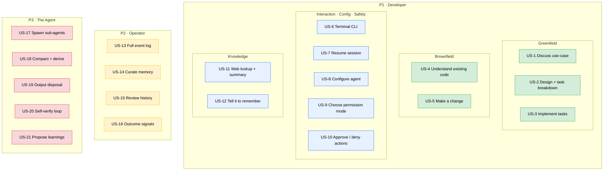

# Requirements — codingAgent

> Working name: **codingAgent** (final product name deferred — see `design-progress.md` § 2).
> This document holds all of Phase 1. Sub-phases land in order: **1a** personas + user stories (this draft) → **1b** EARS acceptance criteria → **1c** numeric NFRs.

---

## Phase 1a — Personas & User Stories

### What this product is (one paragraph, for orientation only)

An LLM-based coding agent: a **local terminal CLI**, written in **Java**, that talks to models on **AWS Bedrock** and drives a tool-using loop to read, write, and verify code. It has two playbooks over one engine — **greenfield** (discuss → requirements → design → tasks → implement) and **brownfield** (understand existing code → make changes) — and is built to survive long real-world work through sub-agents, conversation persistence/resume, and a curated memory of learnings. *(Mechanisms are deliberately absent here; they live in Phase 2.)*

### Personas

| ID | Persona | Description |
|----|---------|-------------|
| **P1** | **Developer** | A software engineer who runs the CLI against a local repository to build new code (greenfield) or change existing code (brownfield). The primary user; cares about correct, reviewable results that fit their project and respect their machine. |
| **P2** | **Operator** | The person — often the same engineer wearing a different hat — who inspects the agent *after the fact*: reads logs, curates memory, reviews past sessions, and tracks whether the agent is improving. This persona exists because of the observability and memory-curation requirements. |
| **P3** | **The Agent** | The autonomous actor itself, modeled as a first-class persona so its **self-management** behaviours — spawning sub-agents, compacting context, proposing learnings, disposing of large outputs, self-verifying via build tools — are captured as explicit requirements instead of buried as side-effects. These behaviours have no direct human trigger; they emerge from the agent operating. |

### User stories

#### P1 · Developer — Greenfield (core value)

| ID | Story |
|----|-------|
| **US-1** | As a developer, I want to start a brand-new project by discussing my use-case with the agent, so that I can shape requirements before any code is written. |
| **US-2** | As a developer, I want the agent to turn the agreed requirements into a design and a breakdown of discrete tasks, so that implementation proceeds in reviewable increments. |
| **US-3** | As a developer, I want the agent to implement the planned tasks one at a time, so that I can verify progress incrementally rather than receiving one large drop. |

#### P1 · Developer — Brownfield (core value)

| ID | Story |
|----|-------|
| **US-4** | As a developer, I want the agent to explore and understand my existing codebase, so that its changes fit the structure and conventions already there. |
| **US-5** | As a developer, I want to ask the agent to make a specific change to existing code, so that it edits the right files correctly without me locating them by hand. |

#### P1 · Developer — Interaction, Configuration & Safety

| ID | Story |
|----|-------|
| **US-6** | As a developer, I want to drive the agent from a terminal CLI against my local repository, so that it fits my existing workflow with no extra infrastructure. |
| **US-7** | As a developer, I want to resume a previous session and continue where I left off, so that a task can span multiple sittings. |
| **US-8** | As a developer, I want to configure which model the agent uses, its permission mode, and my project's build/test commands, so that it behaves appropriately for my project. |
| **US-9** | As a developer, I want to choose how much autonomy the agent has — from read-only, through approve-each-action, to fully unrestricted — so that I can match its freedom to my risk tolerance. |
| **US-10** | As a developer, I want to approve or deny the commands and file-writes the agent proposes (in the asking modes), so that I stay in control of what executes on my machine. |

#### P1 · Developer — Knowledge

| ID | Story |
|----|-------|
| **US-11** | As a developer, I want the agent to look up current information from the web and summarize it when its own knowledge is insufficient, so that it isn't limited to its training cut-off. |
| **US-12** | As a developer, I want to explicitly tell the agent to remember a fact or preference, so that it applies it in future sessions without me repeating myself. |

#### P2 · Operator — Observability & Curation

| ID | Story |
|----|-------|
| **US-13** | As an operator, I want a complete log of everything the agent did — prompts, model responses, thinking, tool calls, and their results — so that I can debug its behaviour and improve it. |
| **US-14** | As an operator, I want to inspect, edit, and delete the agent's stored memory, so that I can correct or remove a bad learning before it misleads future sessions. |
| **US-15** | As an operator, I want to review past conversations, including archived/compacted ones, so that I can understand how the agent reached a given result. |
| **US-16** | As an operator, I want success/failure and effort signals captured per task, so that I can measure whether the agent is improving over time. |

#### P3 · The Agent — Autonomous self-management

| ID        | Story                                                                                                                                                                                        |
| --------- | -------------------------------------------------------------------------------------------------------------------------------------------------------------------------------------------- |
| **US-17** | As the agent, I want to spawn one or more scoped sub-agents for well-defined subtasks, so that I can complete large work without exhausting my own context window.                           |
| **US-18** | As the agent, I want to compact a long conversation into a fresh derived one as it nears the context limit — preserving the original — so that I can keep working without losing the thread. |
| **US-19** | As the agent, I want to keep large tool and command outputs from overwhelming my context, so that I stay effective even on verbose build and test output.                                    |
| **US-20** | As the agent, I want to verify my changes by running the project's build/test commands and reacting to the results, so that I converge on code that actually compiles and passes.            |
| **US-21** | As the agent, I want to propose a durable learning (for the developer's approval) when I discover something worth remembering, so that I don't repeat the same mistake later.                |

### Story map

**Legend** — 🟩 core value (the coding capabilities the tool exists for) · 🟦 developer-facing enablers · 🟨 operator-facing operational · 🟥 agent autonomous self-management.

### Out of scope (v1) — with destinations

| Excluded from v1 | Destination |
|------------------|-------------|
| AST / JDT / LSP static code analysis | **Dropped** — build tools are ground truth. Future-work *if* symbol-precision ever proves necessary. |
| Reinforcement-learning *training* (reward model, DPO, fine-tuning, weight updates) | **Future-work** (RL ladder rungs 4–5). v1 stops at curated memory + outcome capture. |
| Auto-extraction of memory without human approval | **Deferred** to a later stage. v1 = explicit + agent-proposed-and-approved. |
| Embeddings / RAG / vector retrieval (for code or memory) | **Future-work** (memory retrieval rung 3). v1 = index + selective load. |
| Multi-user / shared service / long-running daemon | **Future-work**. v1 = single-user local CLI. |
| Non-Java code-generation *targets* | **Future-work** — core is language-agnostic; a Java/Maven config ships first. |
| Non-Bedrock model providers (OpenAI, Anthropic direct, local models) | **Future-work**. v1 = AWS Bedrock only. |
| IDE plugin / GUI / web front-end | **Future-work**. v1 = terminal CLI only. |
| MCP-compatible tool registry | **Future-work**. |
| Container / Docker sandboxing | **Future-work**. v1 safety surface = permission gate. |
| Streaming / background execution of long-running commands | **Future-work**. v1 = synchronous capture with timeout. |
| Brazil packaging | **Future-work**. v1 = Maven + open-source GitHub. |

---

_Next sub-phase: **1b — EARS acceptance criteria** (3–8 per user story, symbolic `NFR-*` references, behavioral-defaults table). Not started._
