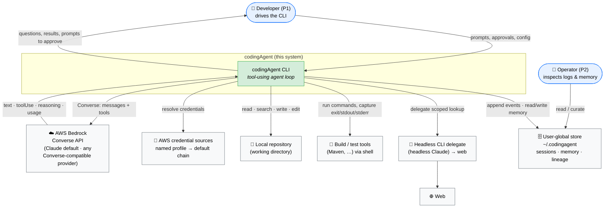

# Overview — codingAgent

> **Phase 2, artifact 1 of 5.** This file frames *what* the system is, *who* it serves, *what it touches*, and *which quality attributes* dominate. It deliberately stops short of *how* — component decomposition, the agent loop, and the ADRs live in `02-architecture.md`. Mechanisms named here are for orientation only.

## 1. Purpose

**codingAgent** is a local, single-user **command-line coding agent** for Java developers. It runs on the developer's machine, talks to a **Claude** model on **AWS Bedrock** through the **Converse API**, and drives a tool-using loop that reads, writes, and verifies code in a local repository. Because Converse is one interface across all Bedrock model families, the engine is **designed to be provider-agnostic** (swap to Amazon Nova, Meta Llama, Mistral, … by configuration); **v1 targets and validates Claude only** — other providers are an architectural seam, not a shipped, tested path.

It operates in two modes over one engine:

- **Greenfield** — start from an idea: discuss the use-case, capture requirements, produce a design and a task breakdown, then implement the tasks incrementally (each verified before the next).
- **Brownfield** — start from an existing repo: explore and understand the code by reading it, then make the requested changes and verify them.

It is built to survive *real* work — long tasks, large repositories, verbose build output — through three deliberate capabilities: **sub-agents** (offload scoped subtasks to isolated context), **conversation persistence with compaction** (resume across sittings; continue past the context limit), and a **curated memory of learnings** (stop repeating mistakes across sessions). Everything it does is recorded to an append-only event log for debugging and improvement.

## 2. The problem it solves

A developer using a raw LLM for coding hits five walls. codingAgent exists to knock each one down:

| Wall | Consequence without the tool | How codingAgent answers it |
|------|------------------------------|----------------------------|
| **The model can't act** | Copy-paste between chat and editor; the model never sees real build output | A tool-using loop that reads/writes files and runs the project's build/test commands, feeding results back (US-4, US-5, US-20) |
| **The context window is finite** | Long tasks derail; large files blow the window | Sub-agents, compaction-with-derivation, and output disposal keep the working set lean (US-17, US-18, US-19) |
| **Sessions are amnesiac** | Re-explain the project every time; repeat past mistakes | Persistent, resumable sessions + a curated cross-session memory (US-7, US-12, US-21) |
| **Autonomy is all-or-nothing** | Either babysit every keystroke or hand over the keys | A four-mode permission model from read-only to unrestricted, with a destructive-command carve-out (US-9, US-10) |
| **The agent is a black box** | Can't tell why it did what it did; can't improve it | Everything — prompts, thinking, tool calls, results, outcomes — is logged and inspectable (US-13, US-15, US-16) |

## 3. Scope

### 3.1 In scope (v1)

- A **terminal CLI**, single-user, one repository per invocation.
- **AWS Bedrock Converse** as the sole model backend; **Claude as the only validated/shipped model family in v1**, model id configurable. The model boundary is built behind a **provider-agnostic abstraction** (Converse already normalizes across families; provider-specific capabilities — extended thinking, prompt-cache token minimums, model-specific inference params — sit behind a **model-capability layer**), so swapping to another Bedrock provider later is a config + capability-profile change, not a rewrite. **Validating non-Claude providers is explicitly post-v1.**
- **Greenfield** and **brownfield** modes.
- The coding toolkit as **the agent's own tools**: read, search (grep/glob), write/edit files, run commands.
- **Build-tool verification** as ground truth (Java/Maven first; the command set is configured, not hard-coded).
- **Sub-agents** (one by default, configurable to N).
- **Persistence**: event-log sessions, resume, compaction-with-derivation, lineage.
- **Memory**: two tiers (global + project), markdown + index, human-curated.
- **Web lookup** by delegating to an external headless CLI (e.g. headless Claude).
- A **four-mode permission model** governing every write/exec/network/spawn action.
- **AWS credentials** via a named profile, falling back to the default credential provider chain.

### 3.2 Out of scope (v1)

Each item names its destination; full table in `00-requirements.md` § "Out of scope".

- **AST / JDT / LSP static analysis** — dropped; build tools are ground truth.
- **RL *training*** (reward model, DPO, fine-tuning) — future work; v1 stops at curated memory + outcome capture.
- **Auto-extraction of memory** without approval — deferred; v1 is explicit + proposed-and-approved.
- **Embeddings / RAG / vector retrieval** — future work; v1 uses index + selective load.
- **Non-Claude model providers** (Nova, Llama, Mistral, …) — *architecturally supported* via the provider-agnostic seam, but **not validated or shipped in v1**; bringing one up is post-v1.
- **Multi-user / service / daemon**, **IDE/GUI**, **non-Java targets**, **non-Bedrock providers** (OpenAI, Anthropic-direct, local), **MCP tool registry**, **container sandboxing**, **streaming/background long commands**, **Brazil packaging** — all future work.

Two deliberate "agnostic core, narrow v1 target" stances: the core is **language-agnostic** (comprehension is text+search; verification is configured commands) but v1 *ships* a Java/Maven configuration; and the model boundary is **provider-agnostic** but v1 *ships* and validates Claude only. Both are seams kept open without paying their validation cost now.

## 4. Actors (for the design reader)

Reframed from the Phase 1 personas (`00-requirements.md` § 1a) toward what each actor *exchanges* with the system.

| Actor | Interacts by | Expects |
|-------|--------------|---------|
| **Developer** (P1) | Terminal: prompts, approvals/denials, config, mode selection | Correct, reviewable code changes; control over what runs; resumable work |
| **Operator** (P2) | Reading the event log, sessions, and memory store (files); editing/deleting memory | Full transparency; ability to correct a bad learning; improvement signals |
| **The Agent** (P3) | Autonomously, within a session: spawns sub-agents, compacts, disposes output, self-verifies, proposes learnings | Enough context room and tooling to finish the task; its actions recorded |

The Agent is modeled as an actor because several requirements (US-17..US-21) have **no direct human trigger** — they are behaviours the system performs on itself.

## 5. System context (C4 Level 1)

## 6. External contracts (summary)

Prose only; exact shapes are pinned in `04-apis.md` and `06-formal/`.

- **AWS Bedrock Converse API** *(consumed)* — the model backend. Stateless request/response: we send the full conversation (`messages[]`), a `system[]` prompt, and tool definitions (`toolConfig`); we receive assistant content blocks, a `stopReason` that drives the loop, and exact token `usage`. **Converse is one interface across all Bedrock model families** — the same code path serves Claude, Nova, Llama, Mistral, etc., swapping by `modelId`; provider-specific inference parameters pass through `additionalModelRequestFields`. We default to Claude and treat optional capabilities (extended thinking, prompt caching) as feature-detected, not assumed. Credentials resolve via a named AWS profile, falling back to the default provider chain. *(Verified API facts: `design-progress.md` § 6.A.1.)*
- **Local repository / filesystem** *(read + written)* — the working directory is the unit of work; the agent reads and searches freely (non-gated) and writes/edits under the permission model.
- **Build / test tools** *(invoked)* — configured commands (e.g. `mvn …`) run as subprocesses; the **exit code is the verification signal**. The contract is "a command, captured as `{exit_code, stdout, stderr, duration}`," not any specific tool.
- **Headless CLI delegate** *(invoked)* — a constrained subprocess (print-mode, restricted tools, timeout) used for capabilities the agent lacks natively, primarily web search/summary. Returns text.
- **User-global store** `~/.codingagent/` *(owned)* — not a third-party contract but a durable on-disk format the Operator reads directly: JSONL session logs, markdown memory, lineage. Stable enough to hand-edit.

## 7. Key quality attributes

Distilled from the NFRs (`00-requirements.md` § 1c) — the attributes that most shape the architecture.

| Attribute | Target / driver | Source |
|-----------|-----------------|--------|
| **Provider portability** (design) / **Claude-only** (v1 target) | One code path designed across Bedrock providers (swap by `modelId`, provider-specific bits behind a capability layer); **v1 validates Claude only**; sub-agent may run a cheaper Claude model | Converse API; `NFR-MODEL-SUBAGENT`, `NFR-MODEL-PROVIDER` |
| **Observability** | Every prompt/thinking/tool/result/outcome logged, append-only JSONL, flushed per event | US-13; `NFR-LOG-*` |
| **Controllability (safety)** | Four permission modes; destructive denylist always prompts; read/invoke-only AWS | US-9/10; `NFR-PERMISSION-*`, RD-2 |
| **Context survivability** | Compact at 0.85 of window; sub-agents isolate; output disposal at 16 KB | US-17/18/19; `NFR-CONTEXT-*` |
| **Resumability** | Sessions keyed by repo; resume by replaying events; lineage preserved | US-7/15; `NFR-LOG-LOCATION` |
| **Cost-awareness** | Opus default tempered by prompt caching of static prefix; cheaper sub-agent models | `NFR-MODEL-DEFAULT`; Converse caching |
| **Correctness-by-verification** | Build/test exit code is the success signal; ≤ 5 fix iterations then stop | US-20; `NFR-VERIFY-MAX-ITERATIONS`, RD-10 |
| **Testability (of the agent itself)** | JUnit 5; ≥ 80% on business logic; unit suite ≤ 120 s | `NFR-TEST-*` |

## 8. Operating envelope

- **Runs on** Java 21 (LTS), macOS 13+ / Linux (glibc); Windows out of scope (WSL2 expected, untested).
- **Built with** Maven 3.9+; open-source on GitHub.
- **Requires** network egress to AWS Bedrock and resolvable AWS credentials; the headless delegate present on `PATH` for web lookups.
- **Footprint** default 1 GB max heap (excludes subprocesses it spawns); user-global state under `~/.codingagent/`, retained indefinitely.
- **Default model** Claude Opus 4.x on Bedrock (exact id pinned in the engine ADR); v1 validates Claude only, though the model boundary is built to swap providers later. Cost tempered by prompt caching and cheaper sub-agent models.

## 9. Open questions (carried into Phase 2 architecture / ADRs)

These are resolved as `02-architecture.md` and the ADRs are written; none block this overview.

| ID       | Question                                                                                                                    | Likely home                   |
| -------- | --------------------------------------------------------------------------------------------------------------------------- | ----------------------------- |
| **OQ-A** | How is a tool defined and registered internally, and how does that map to a Converse `toolSpec`?                            | architecture + tool ADR       |
| **OQ-B** | How formal is the greenfield workflow — lightweight scaffold or full spec-driven structure? (flagged in 1b)                 | architecture / operations     |
| **OQ-C** | Are sub-agents in-process (threads) or separate processes? What's the isolation boundary?                                   | architecture + sub-agent ADR  |
| **OQ-D** | Who generates the compaction summary — a dedicated model call, and with what prompt?                                        | architecture + compaction ADR |
| **OQ-E** | The exact normalized-prefix matching algorithm for `ASK_ONCE_THEN_REMEMBER` (RD-1) and the full destructive denylist (RD-2) | permission ADR                |
| **OQ-F** | When (if ever in v1) does memory need retrieval beyond index + selective load?                                              | memory ADR / future-work      |
| **OQ-G** | Config file format and layout (global vs project); how the precedence chain (AC-8.2) is implemented                         | architecture / operations     |
| **OQ-H** | CLI interaction model: interactive REPL, one-shot invocation, or both?                                                      | architecture / apis           |
| **OQ-I** | Prompt-caching checkpoint placement strategy and its cost/latency payoff for the Opus default                               | prompt-caching ADR            |
| **OQ-J** | Model-capability abstraction: which capabilities are feature-detected (extended thinking, prompt caching, tool-use support, context-window size), how `modelId` resolves to a capability profile, and how the loop degrades when a capability is absent on a non-Claude provider | architecture + model-provider ADR |

## 10. Future work (explicitly deferred)

Beyond the v1 out-of-scope list, the brainstorm identified a forward path worth recording: **RL ladder** rung 3 (trajectory/few-shot retrieval over captured outcomes) and rungs 4–5 (reward model / DPO / weight-level training); an **auto-reflection sub-agent** that harvests learnings without prompting; **MCP-compatible** tool registry; **additional language/build configs** (Gradle, npm, cargo) on the language-agnostic core; **container sandboxing**; and **streaming/background** execution of long-running commands.

## 11. Reading onward

- `02-architecture.md` — component decomposition, the agent-loop sequence, failure-handling matrix, concurrency/shutdown, and the ADRs (engine/SDK, command-execution spine, permission model, persistence/event-sourcing, memory, delegation, prompt-caching, sub-agents).
- `03-data-model.md` — the Conversation tree, event types, content blocks, enums, invariants.
- `04-apis.md` — CLI contract, the Bedrock Converse boundary, delegate and tool contracts.
- `05-operations.md` — build, run, observability, failure remediation.
- `06-formal/` — JSON schemas, the loop state machine, exit codes, contract tests, fixtures.
- `design-progress.md` § 6 — the carry-forward decisions from brainstorming; § 6.A.1 — verified Converse API facts.
