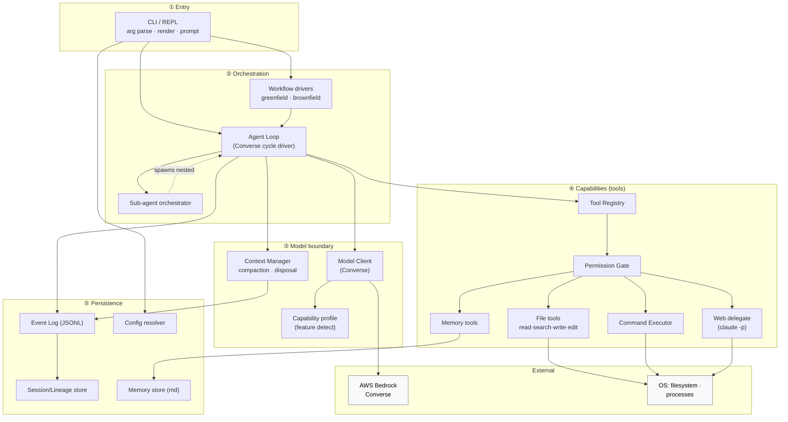
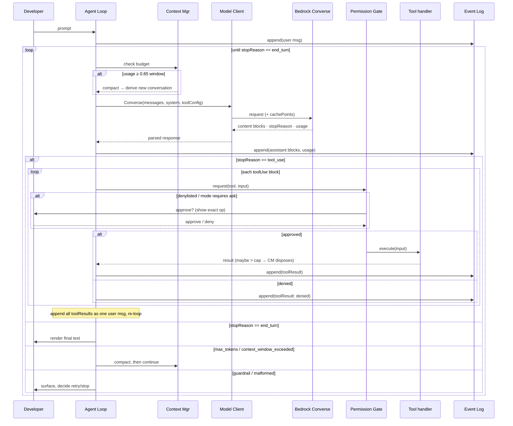

# Architecture — codingAgent

> **Phase 2, artifact 2 of 5.** This file decomposes the system into components, shows how the agent loop runs, how failures map to exits, and how concurrency/shutdown work. **ADRs are drafted separately** (under `adr/`) after this skeleton is approved; where a decision is load-bearing here, it's referenced as `[→ ADR-NNNN]` with a one-line summary. Verified Bedrock facts this builds on: `design-progress.md` § 6.A.1–A.3.

## 1. Component model

### 1.1 Layered view

The system is a layered monolith — one CLI process, no network services of its own. Dependencies point downward; nothing in a lower layer calls upward.



### 1.2 Component responsibilities & invariants

Each component, what it owns, and the invariant it must preserve. The **Refs** column maps to the user stories / ACs / NFRs it serves; the **ADR** column flags where the deep decision lives.

| #   | Component                  | Responsibility                                                                                                                                  | Key invariant                                                                             | Refs                                   | ADR                |
| --- | -------------------------- | ----------------------------------------------------------------------------------------------------------------------------------------------- | ----------------------------------------------------------------------------------------- | -------------------------------------- | ------------------ |
| C1  | **CLI / REPL**             | Parse args, render output, host the interactive prompt, collect approvals                                                                       | Never executes a tool directly — only via the loop                                        | US-6, AC-6.*                           | —                  |
| C2  | **Agent Loop**             | Drive the Converse cycle: send → parse blocks → dispatch tools → append results → repeat on `stopReason`                                        | One in-flight model call per conversation; every block logged before acting               | US-3/5/20                              | ADR-0001           |
| C3  | **Workflow drivers**       | Greenfield (discuss→design→tasks→implement) and brownfield (understand→change) playbooks over C2                                                | Mode is fixed for a session; greenfield gates on approval before writing source           | US-1/2/3/4/5                           | ADR-0012           |
| C4  | **Model Client**           | One adapter over Bedrock Converse: build request, stream response, surface `stopReason`/`usage`; honor credential chain                         | Provider-agnostic surface; no business logic; read/invoke only                            | US-8, NFR-MODEL-*, NFR-AWS-CREDENTIALS | ADR-0002, ADR-0011 |
| C5  | **Capability profile**     | Resolve `modelId` → capabilities (extended thinking, prompt-cache mins, context window, tool-use)                                               | Loop degrades gracefully when a capability is absent                                      | NFR-MODEL-PROVIDER, OQ-J               | ADR-0002           |
| C6  | **Context Manager**        | Track token usage; trigger compaction at threshold; dispose oversized tool output                                                               | Never mutate prior turns in place (signature-safe); compaction derives a new conversation | US-18/19, NFR-CONTEXT-*                | ADR-0006           |
| C7  | **Tool Registry**          | Hold tool definitions (`name`, description, JSON inputSchema); render them to Converse `toolConfig`; dispatch `toolUse` to handlers             | A tool's schema and its handler agree; unknown tool → structured error                    | OQ-A, AC-?                             | ADR-0001           |
| C8  | **Permission Gate**        | Classify every tool call (Class R / X), apply the active `PermissionMode`, enforce the destructive denylist, collect approvals, remember grants | No Class X side effect executes without a gate decision; denylist always prompts          | US-9/10, RD-1..RD-6                    | ADR-0004           |
| C9  | **File tools**             | read, grep/glob search, write, edit within the workspace                                                                                        | Class R never gated; writes go through C8                                                 | US-4/5, AC-4.*/5.*                     | —                  |
| C10 | **Command Executor**       | Run named/ad-hoc commands as subprocesses; capture `{exit, stdout, stderr, duration}`; enforce timeout                                          | Every command passes C8; output over cap goes to C6 disposal                              | US-20, NFR-CMD-*, RD-10                | ADR-0003           |
| C11 | **Web delegate**           | Constrained `claude -p` subprocess for web_search/web_fetch; return summarized text                                                             | Subprocess is sandboxed (web-only tools, timeout, no repo write)                          | US-11, NFR-NET-*                       | ADR-0008           |
| C12 | **Memory tools**           | Read/write/propose learnings across global + project tiers; maintain index                                                                      | Writes require approval; entries are plain markdown a human can edit                      | US-12/14/21, RD-9                      | ADR-0007           |
| C13 | **Sub-agent orchestrator** | Spawn a nested Agent Loop with isolated context + budget; return summary                                                                        | ≤ `NFR-SUBAGENT-MAX` concurrent; child gets no remembered grants                          | US-17, RD-5                            | ADR-0010           |
| C14 | **Event Log**              | Append every event to per-session JSONL; flush per event                                                                                        | Append-only; a crash loses ≤ 1 event                                                      | US-13, NFR-LOG-*                       | ADR-0005           |
| C15 | **Session/Lineage store**  | Persist sessions keyed by repo; record `derived-from`/`spawned-by` edges                                                                        | Originals never deleted on compaction                                                     | US-7/15, RD-8                          | ADR-0005           |
| C16 | **Memory store**           | On-disk markdown + index, two tiers under `~/.codingagent/`                                                                                     | Re-read fresh each load; hand-editable                                                    | US-14, RD-9                            | ADR-0007           |
| C17 | **Config resolver**        | Resolve config by precedence (flags > project > global > defaults)                                                                              | Malformed config → exit 2 before any model call                                           | US-8, AC-8.*                           | ADR-0009           |

### 1.3 Why a layered monolith (not microservices / plugins)

Single-user local CLI, one process — there is no scaling axis that would justify process boundaries inside v1. Sub-agents are the one place we *could* fork processes; that's an isolation decision deferred to ADR-0010, not a service boundary. The tool layer is the designed extension seam (new tool = new registry entry + handler), which keeps the MCP-registry future-work path open without paying for it now.

## 2. The agent loop (the heartbeat)

The loop is the Converse client-side tool-use cycle (`design-progress.md` § 6.A.1) with our **permission gate inline** and **every block logged before it acts**.



Two properties this diagram encodes, both load-bearing:

1. **Log-before-act.** Every assistant block and every tool result is appended to the event log *before* the next step. A crash mid-task leaves a replayable trace (US-13), and resume (AC-7.2) is just replaying these appends into a fresh `messages[]`.
2. **Gate-in-the-middle.** The permission gate sits *between* parsing a `toolUse` and executing it — the single chokepoint for all side effects (ADR-0004). Read-class tools still flow through it but are auto-approved (AC-9.6).

## 3. Failure handling

### 3.1 `stopReason` → loop action

Per the verified `stopReason` set (§ 6.A.1):

| `stopReason` | Loop action | User-visible? |
|--------------|-------------|---------------|
| `end_turn` | Return final text; await next prompt | yes (result) |
| `tool_use` | Dispatch tools → append results → re-loop | only if a tool needs approval |
| `max_tokens` | Continue generation (re-call) or surface if a hard cap | progress note |
| `model_context_window_exceeded` | Compact → derive → continue (AC-18) | compaction note |
| `stop_sequence` | Treat as end_turn unless a workflow uses sequences | yes |
| `guardrail_intervened` / `content_filtered` | Surface; do not retry blindly | yes (warning) |
| `malformed_tool_use` / `malformed_model_output` | Repair-retry up to a small bound, then surface | on repeated failure |

### 3.2 Error / exit matrix

Maps the Bedrock SDK error taxonomy (§ 6.A.1) and internal failures to the CLI exit codes (`00-requirements.md` § 1b seed; formalized in `06-formal/cli-exit-codes.md`).

| Trigger | Detecting component | Retry? | Exit (if fatal) |
|---------|---------------------|--------|-----------------|
| `ThrottlingException` 429, `ServiceUnavailable` 503, `ModelTimeout` 408, `ModelNotReady` 429, `InternalServer` 500 | Model Client | yes — backoff, ≤ `NFR-BEDROCK-MAX-RETRIES` | 4 on exhaustion |
| `ValidationException` 400, `AccessDenied` 403 | Model Client | no | 4 |
| No usable credentials (bearer/profile/chain all fail) | Config resolver / Model Client | no | 4 |
| Malformed / missing config | Config resolver | no | 2 |
| Bad CLI args | CLI | no | 2 |
| Required approval denied, blocking progress | Permission Gate | n/a | 3 |
| Command exceeds `NFR-CMD-TIMEOUT` | Command Executor | surfaced as tool failure to model | — (loop decides) |
| Verify fails after `NFR-VERIFY-MAX-ITERATIONS` | Workflow driver | no | surfaced, not necessarily fatal |
| Compaction cannot recover context | Context Manager | no | 5 |
| Sub-agent fails / over budget | Sub-agent orchestrator | parent decides | — (failure result to parent) |
| Event cannot be persisted | Event Log | no | 1 (surface; don't pretend logged) |
| SIGINT (Ctrl-C) | CLI signal handler | n/a | 130 |
| Unhandled internal error | top-level handler | no | 1 |

## 4. Concurrency, shutdown, signals

- **Concurrency model.** The main agent loop is **single-threaded per conversation** — one in-flight Converse call at a time (the `messages[]` array is a serial accumulator; the reasoning-signature rule in § 6.A.1 forbids interleaving). Parallelism enters only via **sub-agents** (C13): each runs its own loop with its own `messages[]`; the parent blocks on, or polls, their summarized results. v1 ships `NFR-SUBAGENT-MAX = 1` (one child at a time), so true parallel execution is config-gated and deferred — the *seam* exists, the concurrency does not by default. [→ ADR-0010]
- **Subprocess management.** Command Executor (C10) and Web delegate (C11) spawn OS processes with a timeout (`NFR-CMD-TIMEOUT`, `NFR-NET-WEBLOOKUP-TIMEOUT`). On timeout the process is killed (process-tree kill, not just the parent) and the failure surfaced as a tool result.
- **Shutdown / SIGINT.** Ctrl-C interrupts the current step: an in-flight Converse stream is cancelled; an in-flight subprocess is killed; the event log is flushed (it's flushed per-event anyway, so at most the in-flight event is lost). The session remains resumable. Exit 130.
- **Crash safety.** Because the event log is append-only and flushed per event (`NFR-LOG-DURABILITY`), an abrupt kill leaves a consistent, replayable session up to the last completed event.

## 5. Key cross-cutting flows (forward pointers)

These flows span components; each is detailed in its ADR and (where stateful) the Phase 3 state machine.

- **Compaction** (C6 → C14/C15): threshold hit → summarize current conversation via a model call → write a new session with `derived-from` edge → carry forward task state → original preserved. [→ ADR-0006; state machine in `06-formal/`]
- **Sub-agent spawn** (C13): parent emits a `spawn_subagent` tool call → orchestrator starts a nested loop with a scoped prompt + budget + fresh context → returns a summary block the parent appends. [→ ADR-0010]
- **Memory propose-and-approve** (C12 → C16): agent proposes a learning → developer approves → write markdown entry + index line + log a memory event. [→ ADR-0007]
- **Credential resolution** (C17 → C4): bearer token → named profile → default chain; first success wins; total failure → exit 4. [→ ADR-0011]

## 6. Module boundaries (provisional package layout)

A first cut at Java package structure, to be confirmed in Phase 4 task breakdown. One package per layer; the tool layer is the extension seam.

```
com.srk.codingagent
├── cli            (C1)            entry, REPL, rendering, approval prompts
├── workflow       (C3)            greenfield · brownfield drivers
├── loop           (C2)            agent loop, stopReason dispatch
├── model          (C4, C5)        Converse client, capability profiles, credentials
├── context        (C6)           token budget, compaction, output disposal
├── tool           (C7, C8)        registry, permission gate, classification
│   ├── file       (C9)
│   ├── exec       (C10)
│   ├── web        (C11)
│   └── memory     (C12)
├── subagent       (C13)          orchestrator
├── persist        (C14, C15)     event log, session/lineage store
├── memory         (C16)          markdown store + index
└── config         (C17)          resolver, model
```

## 7. What this enables / defers

- **Enables now:** the brownfield loop (C1·C2·C4·C7·C8·C9·C10·C14), which is Stage 0/1 of the build. Everything else layers onto this spine.
- **Defers cleanly:** sub-agent parallelism (seam at C13), memory retrieval beyond index (C16), MCP tool registry (C7), additional providers (C5), additional language/build configs (C10 is command-driven, so this is config not code).

## 8. Open questions resolved here vs. carried

Resolved by this skeleton: **OQ-A** (tools are registry entries → `toolConfig`, C7), **OQ-C** partial (sub-agents are nested loops; in-process-vs-fork deferred to ADR-0010), **OQ-G** partial (config resolver C17; format in ADR-0009), **OQ-H** (CLI hosts both one-shot and REPL — C1). Carried to ADRs: **OQ-B** (greenfield formality → ADR-0012), **OQ-D** (compaction summary generation → ADR-0006), **OQ-E** (denylist + match algorithm → ADR-0004), **OQ-F** (memory retrieval → ADR-0007), **OQ-I** (cache placement → ADR-0006/engine), **OQ-J** (capability layer → ADR-0002).

## 9. ADR queue (drafted after this is approved)

| ADR | Title | Resolves |
|-----|-------|----------|
| 0001 | Engine: AWS SDK v2 + Converse, owned loop | C2, C7 |
| 0002 | Model-provider abstraction + capability layer | C4, C5, OQ-J |
| 0003 | Command execution as the verification + safety spine | C10 |
| 0004 | Permission model (4 modes, Class R/X, denylist, match) | C8, OQ-E |
| 0005 | Persistence: event-sourced JSONL + conversation tree | C14, C15 |
| 0006 | Context management: compaction-with-derivation + output disposal | C6, OQ-D, OQ-I |
| 0007 | Memory: two-tier markdown + index, curated writes | C12, C16, OQ-F |
| 0008 | Web delegation via constrained headless Claude (Responses API alt-considered) | C11 |
| 0009 | Configuration model + precedence | C17, OQ-G |
| 0010 | Sub-agent orchestration + isolation | C13, OQ-C |
| 0011 | Bedrock credential resolution (bearer→profile→chain) | C4 |
| 0012 | Greenfield workflow formality | C3, OQ-B |

## 10. Reading onward

- `adr/` — the decision records queued in § 9.
- `03-data-model.md` — the Conversation tree, event types, content blocks, enums, invariants (INV-*).
- `04-apis.md` — CLI contract, Converse boundary, tool/delegate contracts.
- `05-operations.md` — build, run, observability, failure remediation.
- `design-progress.md` § 6.A.1–A.3 — the verified Bedrock facts this architecture builds on.
