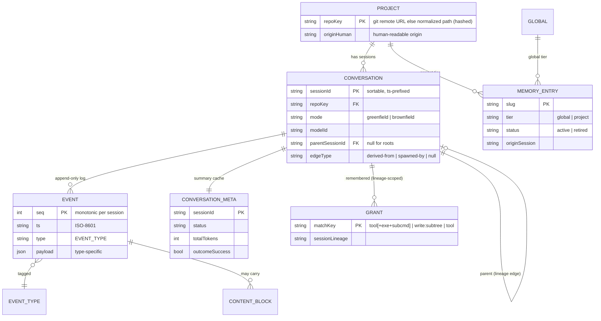

# Data Model — codingAgent

> **Phase 2, artifact 3 of 5.** Formalizes the domain types the ADRs named: the conversation tree, events, content blocks, enums, value objects, their invariants (`INV-*`), the compaction lifecycle state machine, and the wire-format boundary to Converse. Types are described language-neutrally (Java records/enums in Phase 5); JSON schemas for the persisted shapes are Phase 3 (`06-formal/`). Sources: ADR-0005 (persistence), ADR-0006 (compaction), ADR-0002 (capability), ADR-0003 (command), ADR-0004 (permission), ADR-0007 (memory).

## 1. Domain overview (ER)

The load-bearing shape (ADR-0005): **a `Conversation` is a session is one JSONL event log.** Main sessions, compaction continuations, and sub-agents are the *same* entity, distinguished only by `edgeType`.

## 2. Core entities

### 2.1 Conversation (session)

| Field | Type | Notes |
|-------|------|-------|
| `sessionId` | string | sortable, timestamp-prefixed; captured at boundary |
| `repoKey` | string | git remote URL when present, else normalized abs path; hashed for FS |
| `mode` | `Mode` enum | `GREENFIELD` \| `BROWNFIELD`; fixed for the session's life |
| `modelId` | string | the model this session runs (sub-agent may differ — ADR-0002) |
| `parentSessionId` | string? | null for a root |
| `edgeType` | `EdgeType` enum? | `DERIVED_FROM` \| `SPAWNED_BY` \| null (root) |
| events | append-only `Event[]` | the JSONL log; the source of truth |

### 2.2 Event

The atomic unit of the log (ADR-0005). Common envelope + type-specific payload.

| Field | Type | Notes |
|-------|------|-------|
| `seq` | int | monotonic per session, gap-free |
| `ts` | string | ISO-8601, captured at boundary |
| `type` | `EventType` enum | see § 3 |
| `payload` | object | shape determined by `type` |

### 2.3 ContentBlock (our mirror of a Converse block)

A discriminated union mirroring Converse `ContentBlock`s (§ 6.A.1), so persisted events round-trip to `messages[]` on replay.

| Variant | Carries | Notes |
|---------|---------|-------|
| `TextBlock` | text | |
| `ToolUseBlock` | toolUseId, name, input(json) | model → us |
| `ToolResultBlock` | toolUseId, content, status(ok/error), truncated?, fullRef? | us → model |
| `ReasoningBlock` | text, **signature**, redactedContent? | **replayed verbatim** — signature tamper-checked (INV-7) |
| `ImageBlock` | format, bytes | **input only** (developer → model); format ∈ `png\|jpeg\|gif\|webp` (Converse `ImageBlock`); for design diagrams/screenshots |
| `DocumentBlock` | name, format, bytes | **input only**; format ∈ `pdf\|csv\|doc\|docx\|xls\|xlsx\|html\|txt\|md` (Converse `DocumentBlock` — Word/Excel attach natively, no conversion); for use-case docs/specs. `name` MUST be neutral/sanitized (INV-18 — prompt-injection surface) |
| `CachePointBlock` | (marker) | placed per ADR-0006; capability-gated |

**Multimodal scope (v1):** image + document **input** is supported — load-bearing for greenfield/spec-driven (ADR-0012): developers share design diagrams (US-1) and PDF/Word use-case docs. Sourced as **raw bytes** (the SDK base64-encodes; S3-source is OOS for a local CLI). Multimodal is **capability-gated** via `ModelCapabilityProfile` (§ 2.6) — a model that doesn't accept images/documents degrades gracefully. **Still OOS v1:** image/video *generation* (output) and *video input* (Converse `VideoBlock`).

### 2.4 CommandResult (ADR-0003)

| Field | Type | Notes |
|-------|------|-------|
| `command` | string | as executed |
| `exitCode` | int | the verification signal (RD-10) |
| `stdout` / `stderr` | string | post-disposal may be truncated |
| `durationMs` | long | |
| `timedOut` | bool | tree-killed on `NFR-CMD-TIMEOUT` |
| `truncated` | bool | output exceeded `NFR-OUTPUT-MAX-INLINE`; full in log via `fullRef` |

### 2.5 MemoryEntry (ADR-0007)

| Field | Type | Notes |
|-------|------|-------|
| `slug` | string | filename id |
| `tier` | `MemoryTier` enum | `GLOBAL` \| `PROJECT` |
| `created` | string | ISO ts, boundary-captured |
| `originSession` | string | provenance |
| `why` | string | one-line provenance |
| `status` | `MemoryStatus` enum | `ACTIVE` \| `RETIRED` |
| body | markdown | the learning; cites the symbol it concerns |

### 2.6 ModelCapabilityProfile (ADR-0002)

| Field | Type | Notes |
|-------|------|-------|
| `providerFamily` | `ProviderFamily` enum | `ANTHROPIC` \| `AMAZON` \| `META` \| `MISTRAL` \| `OTHER` |
| `contextWindowTokens` | int | drives compaction threshold (ADR-0006) |
| `supportsExtendedThinking` | bool | + `thinkingBudgetConfigurable` bool |
| `promptCache` | `PromptCacheCaps`? | minTokensPerCheckpoint, maxCheckpoints, ttls; null = unsupported |
| `supportsToolUse` | bool | |
| `supportsImageInput` | bool | accepts `ImageBlock` (multimodal input) |
| `supportsDocumentInput` | bool | accepts `DocumentBlock` (multimodal input) |
| `inferenceParamPassthrough` | string[] | valid `additionalModelRequestFields` keys |

Unknown `modelId` → a **conservative default profile** (no thinking, no cache, no image/document input, tool-use assumed, safe window from config). When `supportsImageInput`/`supportsDocumentInput` is false, the agent declines/omits the attachment with a clear message rather than failing the call (graceful degradation).

### 2.7 Grant (ADR-0004)

| Field | Type | Notes |
|-------|------|-------|
| `matchKey` | string | `run_command:<exe>[ <subcmd>]` \| `write:<subtree>` \| `<tool>` |
| `sessionLineage` | string | scope — session + its derived continuations; not cross-session, not inherited by sub-agents |

### 2.8 ResolvedConfig (ADR-0009)

Immutable, built once at startup by layered merge (flags > project > global > defaults). Holds `modelId`, `PermissionMode`, command set, `aws.profile`/`region`, `subAgentMax`, summarizer model, thresholds. Components read this, never raw files.

## 3. EventType taxonomy

The 13 event types (ADR-0005), with the content they carry:

| `EventType` | Payload (key fields) | Carries blocks? |
|-------------|----------------------|-----------------|
| `SESSION_START` | mode, repoKey, modelId, permissionMode | — |
| `USER_MESSAGE` | content | Text |
| `MODEL_REQUEST` | messages/system/toolConfig digest (or ref), modelId | — |
| `MODEL_RESPONSE` | stopReason | Text/ToolUse/Reasoning |
| `MODEL_USAGE` | inputTokens, outputTokens, cacheRead/WriteInputTokens | — |
| `TOOL_USE` | toolUseId, name, input | (ToolUse) |
| `PERMISSION_DECISION` | toolUseId, class, mode, decision, matchedGrant? | — |
| `TOOL_RESULT` | toolUseId, result/text, truncated?, fullRef? | (ToolResult) |
| `SUBAGENT_SPAWN` | childSessionId, prompt digest | — |
| `SUBAGENT_RESULT` | childSessionId, summary | — |
| `COMPACTION` | fromSessionId, toSessionId, summaryRef, triggerReason | — |
| `MEMORY_WRITE` | tier, slug, provenance | — |
| `OUTCOME` | taskRef, success, iterations | — |
| `ERROR` | category, message, exitCode? | — |

*(13 named in ADR-0005; `SUBAGENT_SPAWN`/`SUBAGENT_RESULT` split the one "subagent" row, so the table lists 14 rows for 13 logical kinds — both spawn and result are required.)*

## 4. Enumerations

| Enum | Values | Source |
|------|--------|--------|
| `Mode` | GREENFIELD, BROWNFIELD | US-1..5 |
| `PermissionMode` | UNRESTRICTED, READ_ONLY, ASK_EVERY_TIME, ASK_ONCE_THEN_REMEMBER | AC-9.1 |
| `OperationClass` | READ (R), SIDE_EFFECTING (X) | RD-4 |
| `EdgeType` | DERIVED_FROM, SPAWNED_BY | ADR-0005 |
| `EventType` | (the 13 of § 3) | ADR-0005 |
| `StopReason` | END_TURN, TOOL_USE, MAX_TOKENS, STOP_SEQUENCE, GUARDRAIL_INTERVENED, CONTENT_FILTERED, MALFORMED_TOOL_USE, MALFORMED_MODEL_OUTPUT, MODEL_CONTEXT_WINDOW_EXCEEDED | § 6.A.1 |
| `MemoryTier` | GLOBAL, PROJECT | ADR-0007 |
| `MemoryStatus` | ACTIVE, RETIRED | ADR-0007 |
| `ProviderFamily` | ANTHROPIC, AMAZON, META, MISTRAL, OTHER | ADR-0002 |
| `ExitCode` | OK=0, INTERNAL=1, USAGE_CONFIG=2, USER_ABORTED=3, MODEL_BACKEND=4, CONTEXT_EXHAUSTED=5, INTERRUPTED=130 | 1b seed |

## 5. Invariants (INV-*)

Numbered, testable invariants the implementation must preserve. (Phase 3 may promote these into the formal state machine + contract tests.)

| INV | Invariant | Guards |
|-----|-----------|--------|
| **INV-1** | Event `seq` is monotonic and gap-free within a session; events are append-only (never updated/deleted). | ADR-0005, US-13 |
| **INV-2** | Every event is flushed to disk before the loop acts on its consequence (log-before-act). | ADR-0005, NFR-LOG-DURABILITY |
| **INV-3** | A `Conversation` has at most one parent; `edgeType` is non-null iff `parentSessionId` is non-null. | ADR-0005 |
| **INV-4** | A compaction creates a **new** session with `edgeType = DERIVED_FROM`; the parent's events are never mutated. | ADR-0006, US-18 |
| **INV-5** | The original conversation is never deleted on compaction (preserved for history). | RD-8, AC-18.3 |
| **INV-6** | Every `ToolResultBlock.toolUseId` matches a prior `ToolUseBlock.toolUseId` in the same session. | § 6.A.1 protocol |
| **INV-7** | `ReasoningBlock`s are replayed verbatim with their `signature` and all prior messages unchanged within a live conversation (else the Converse call errors). | § 6.A.1 |
| **INV-8** | No `SIDE_EFFECTING` operation executes without a preceding `PERMISSION_DECISION` event for the same `toolUseId`. | ADR-0004, US-10 |
| **INV-9** | A denylisted destructive command is never auto-approved and produces/matches no `Grant`. | RD-2, AC-10.4 |
| **INV-10** | A `Grant` is scoped to its session lineage; it is not read by a separate root session, and not inherited by a sub-agent. | RD-5, AC-10.6 |
| **INV-11** | A sub-agent session has `edgeType = SPAWNED_BY`; the parent context receives only its summary, never its event stream. | ADR-0010, AC-17.4 |
| **INV-12** | Concurrent sub-agents ≤ `NFR-SUBAGENT-MAX` (default 1). | AC-17.3 |
| **INV-13** | A `MemoryEntry` is persisted only after an explicit or approved write; never auto-extracted in v1. | AC-21.4, RD-9 |
| **INV-14** | Memory is re-read from disk on each load (no masking cache); external edits/deletes honored. | AC-14.2 |
| **INV-15** | `CONVERSATION_META` is a derived cache; on disagreement the JSONL event log wins. | ADR-0005 |
| **INV-16** | The Bedrock client authenticates via SigV4 only; an ambient `AWS_BEARER_TOKEN_BEDROCK` is never used. | ADR-0011, AC-8.8 |
| **INV-17** | A unit of work's success is determined by a zero exit from the configured test command. | RD-10, AC-20.4 |
| **INV-18** | A `DocumentBlock.name` is neutral and sanitized (alphanumeric/space/hyphen/parens/brackets, ≤200 chars) — never raw untrusted text (prompt-injection surface). | Converse DocumentBlock; multimodal input |
| **INV-19** | `ImageBlock`/`DocumentBlock` are attached only when the active `ModelCapabilityProfile` reports the corresponding input support; otherwise the attachment is declined with a message, not sent. | ADR-0002, § 2.3 |

## 6. Compaction lifecycle (state machine)

The conversation lifecycle, focused on the compaction transition (ADR-0006). Numbered states; Phase 3 formalizes this in `06-formal/state-machine.md`.

```mermaid
stateDiagram-v2
    [*] --> Active : session_start
    Active --> Active : turn (usage < threshold)
    Active --> Compacting : usage ≥ 0.85×window\nOR /compact\nOR context_window_exceeded
    Compacting --> Derived : summarize → new session\n(derived-from); original preserved
    Derived --> [*] : original archived (read-only)
    Active --> Closed : end session
    Compacting --> Failed : summary/derive fails
    Failed --> [*] : exit 5 (context-exhausted)
    Closed --> [*]
```

- **Active** — normal loop; events appending.
- **Compacting** — threshold/command/overflow triggered; summary model-call in flight (INV-4: no in-place mutation).
- **Derived** — work continues in the new session; the original becomes a read-only lineage node (INV-5).
- **Failed** — compaction couldn't recover context → exit 5.

## 7. Wire-format boundary (our types ↔ Converse)

The translation table between our domain `ContentBlock`s and Converse blocks (§ 6.A.1). This boundary lives in the Model Client (C4); the rest of the system uses our types.

| Our type | Converse block (request/response) | Direction | Notes |
|----------|-----------------------------------|-----------|-------|
| `TextBlock` | `text` | both | |
| `ToolUseBlock` | `toolUse {toolUseId,name,input}` | response → us | from `MODEL_RESPONSE` |
| `ToolResultBlock` | `toolResult {toolUseId,content,status}` | us → request | appended as a user-role message |
| `ReasoningBlock` | `reasoningContent {reasoningText{text,signature},redactedContent}` | both | verbatim replay (INV-7) |
| `ImageBlock` | `image {format, source{bytes}}` | us → request | input only; format png/jpeg/gif/webp; SDK base64-encodes bytes |
| `DocumentBlock` | `document {name, format, source{bytes}}` | us → request | input only; format pdf/csv/doc/docx/xls/xlsx/html/txt/md; neutral `name` (INV-18) |
| `CachePointBlock` | `cachePoint {type}` | us → request | after tools→system→memory-index (ADR-0006) |
| `ResolvedConfig.modelId` | request `modelId` | us → request | |
| (system prompt + memory index) | `system[]` | us → request | cacheable static prefix |
| `Event(MODEL_USAGE)` | response `usage` | response → us | drives compaction (measured) |
| `StopReason` | response `stopReason` | response → us | loop selector |

Replay (resume, AC-7.2) reverses this: events → our blocks → Converse `messages[]`.

## 8. Reading onward

- `04-apis.md` — the CLI contract, the Converse boundary in prose, tool/delegate contracts.
- `05-operations.md` — build, run, observability, remediation.
- `06-formal/` — JSON schemas for the persisted shapes (Event, ContentBlock, CommandResult, MemoryEntry, ResolvedConfig), the formal state machine (from § 6), exit codes, contract tests.
- ADRs: 0005 (persistence), 0006 (compaction), 0002 (capability), 0003 (command), 0004 (permission), 0007 (memory), 0011 (credentials).
