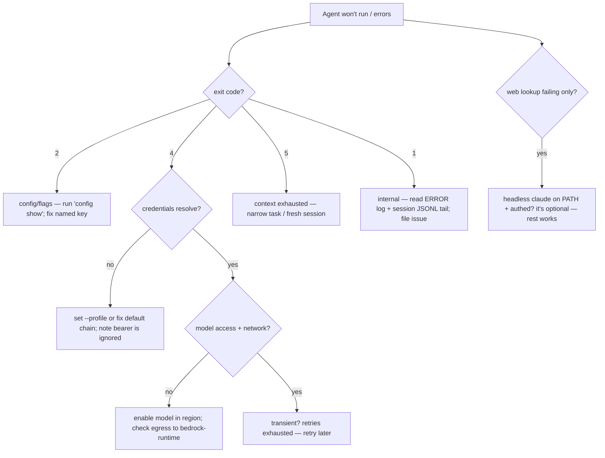

# Operations — codingAgent

> **Phase 2, artifact 5 of 5 (final).** How to build, run, observe, and troubleshoot the agent, plus packaging/distribution and known limits. Synthesizes decisions already made (ADRs 0001–0012); introduces no new ones. Operator-facing (P2). Exact build files (`pom.xml`) and the formal exit-code contract are Phase 3/5; this is the operational narrative.

## 1. Build

- **Toolchain.** Java 21 (`NFR-PLAT-JAVA`), Maven 3.9+ (`NFR-PLAT-BUILD`). Open-source, GitHub.
- **Build command.** `mvn clean verify` — compile, static analysis, unit tests, coverage gate (`NFR-TEST-COVERAGE` ≥ 80% on business logic), packaging. Unit suite ≤ 120 s (`NFR-TEST-RUNTIME`); integration tests tagged `@Tag("integration")` and excluded from the default profile (run via `mvn verify -P integration`).
- **Packaging.** A single self-contained executable JAR (fat/shaded jar) producing the `codingagent` CLI entry point, plus a thin launch script on `PATH`. AWS SDK v2 `bedrockruntime` (`2.46.10`, confirm latest at build — ADR-0001) is the primary runtime dependency.
- **Artifacts.** Build output under `target/`; nothing in `target/` is committed (`.gitignore`).

## 2. Run

### 2.1 Prerequisites

| Prereq | Why | Ref |
|--------|-----|-----|
| Java 21 runtime | the agent's JVM | NFR-PLAT-JAVA |
| AWS credentials resolvable (profile or default chain) | Bedrock calls (SigV4) | ADR-0011 |
| Network egress to `bedrock-runtime.<region>.amazonaws.com` | model inference | — |
| Bedrock model access enabled in the account/region | Claude on Bedrock | — |
| Headless `claude` CLI on `PATH` (authenticated) | **only** for `web_search`/`web_fetch` (ADR-0008) | US-11 |
| `git` (optional) | repo-key derivation prefers the git remote URL | AC-7.3 |

> The headless-claude prereq is **optional** — the agent runs fully without it; only web lookup is unavailable (degrades, doesn't crash).

### 2.2 First run

1. Install the JAR + launcher on `PATH`.
2. (Optional) create `~/.codingagent/config.yaml` — or rely on built-in defaults + flags. Defaults: model = newest Claude Opus, permission mode = `ASK_EVERY_TIME`, region = `us-east-1` (all overridable — ADR-0009).
3. Set AWS credentials: configure an AWS profile (`--profile <name>`) or ensure the default chain resolves. **A stray `AWS_BEARER_TOKEN_BEDROCK` is ignored** (ADR-0011) — the startup line states which credential tier resolved.
4. `cd` into the target repo and run `codingagent` (interactive) or `codingagent -p "…"` (one-shot).

### 2.3 Configuration

Two YAML files (ADR-0009), resolved flags > project > global > defaults:
- **Global** `~/.codingagent/config.yaml` — default model, permission mode, AWS profile/region, sub-agent cap, summarizer model.
- **Project** `~/.codingagent/projects/<repo-key>/project.yaml` — build/test/lint commands, per-repo overrides, human-readable origin.

`codingagent config show` prints the resolved config; `config path` prints file locations. Malformed/unknown keys → exit 2 (fail-fast).

### 2.4 IAM (least privilege)

Grant only (ADR-0011, verified § 6.A.2): `bedrock:InvokeModel`, `bedrock:InvokeModelWithResponseStream`, `bedrock:GetInferenceProfile`, `bedrock:ListInferenceProfiles`. **No** create/update/delete verbs. `AmazonBedrockFullAccess` works but is broader than needed.

## 3. Observability

The event log is the spine of observability (ADR-0005, US-13) — and the Operator's primary surface (P2).

- **Location.** `~/.codingagent/projects/<repo-key>/sessions/<session-id>.jsonl` — append-only, flushed per event, one JSON object per line. Survives `git clean` (user-global). Retained indefinitely (`NFR-LOG-RETENTION`).
- **Inspecting a session.** It's JSONL — `cat`, `jq`, `grep` directly, or `codingagent sessions` to list and `codingagent resume <id>` to continue. Every prompt, model response, thinking block, tool call, permission decision, and result is there (the 13 event types — `03-data-model.md` § 3).
- **Log levels (operational logging, distinct from the event log).** SLF4J, per-package tunable:
  - `INFO` — external-boundary calls (Bedrock request, subprocess spawn, file write), credential tier resolved.
  - `WARN` — non-fatal notables (ignored bearer token, retried Bedrock call, truncated output, declined unsupported attachment).
  - `ERROR` — a failure, once per failure.
  - `DEBUG` — `--debug`-visible internals.
- **Outcome signals.** `OUTCOME` events (success + iterations, from the test exit code per RD-10) are aggregatable across sessions to measure improvement (US-16) — the substrate the future RL ladder reads (overview § 10).
- **Memory audit.** `MEMORY_WRITE` events give the "when/why" history of every learning; the markdown entries carry provenance (ADR-0007).

## 4. Failure remediation

### 4.1 Exit-code → cause → fix

| Exit  | Meaning           | Likely cause                                                        | Fix                                                                                                                        |
| ----- | ----------------- | ------------------------------------------------------------------- | -------------------------------------------------------------------------------------------------------------------------- |
| `0`   | success           | —                                                                   | —                                                                                                                          |
| `1`   | internal error    | unexpected/unhandled                                                | check ERROR log + the session JSONL tail; file an issue                                                                    |
| `2`   | usage/config      | bad flag, malformed/unknown config key, missing required field      | `codingagent config show`; the message names the offending key                                                             |
| `3`   | user-aborted      | a required action was denied, blocking progress                     | re-run and approve, or adjust `--permission-mode`                                                                          |
| `4`   | model-backend     | no usable credentials, Bedrock auth/availability, retries exhausted | verify profile/default-chain resolves; check model access in region; check network; startup line names the credential tier |
| `5`   | context-exhausted | compaction couldn't recover                                         | reduce scope; start a fresh session; check the compaction WARN/ERROR                                                       |
| `130` | interrupted       | Ctrl-C                                                              | expected; session is resumable                                                                                             |

### 4.2 "It doesn't work" decision tree

### 4.3 Common situations

- **"Web search says unavailable."** Headless `claude` not on `PATH` or not authenticated (ADR-0008). Optional prereq — everything else works; install/auth it to enable lookups.
- **"It keeps asking for approval."** You're in `ASK_EVERY_TIME` (default). Use `ASK_ONCE_THEN_REMEMBER` (remembers per tool+prefix / write-subtree) or `UNRESTRICTED` — but destructive denylist always prompts (ADR-0004).
- **"It stopped after 5 tries on a failing test."** `NFR-VERIFY-MAX-ITERATIONS` reached (AC-20.5) — by design; the failing output is surfaced. Investigate, adjust, resume.
- **"An attachment was declined."** The active model lacks image/document input (capability profile, INV-19) — switch model or omit the attachment.
- **"Bearer token seems ignored."** It is, deliberately (ADR-0011) — use a profile or the default chain.

## 5. Distribution

- **Source + releases** on GitHub (open-source). Tagged releases ship the shaded JAR + launcher; build-from-source via `mvn clean verify`.
- **No telemetry.** All state is local under `~/.codingagent/`; nothing is sent anywhere except Bedrock (inference) and, when used, the headless-claude delegate (web lookup).
- **Upgrades.** Replace the JAR; the on-disk session/memory/config formats are stable and forward-compatible within v1 (any migration would be a documented release note).

## 6. Known limits (v1)

- **One repo per invocation**, single-user, local CLI (no daemon/multi-user).
- **Synchronous commands** with timeout — no streaming/background long-runs (future-work).
- **Sub-agents in-process, N=1 default** — a child JVM-level crash can affect the parent (ADR-0010); parallelism is config-gated.
- **Memory is curated + index-loaded** — no semantic retrieval (future-work); large indexes need pruning.
- **Web lookup depends on an external CLI** being installed/authed.
- **Claude-only validated** — other Bedrock providers are an architectural seam, not a shipped path (ADR-0002).
- **Verification = build/test exit code** — no static-analysis pre-check (AST/LSP dropped); a real compile/test runs each verify.

## 7. Reading onward

- `06-formal/` (Phase 3) — JSON schemas, the formal state machine, `cli-exit-codes.md` (authoritative), contract tests, fixtures.
- `07-tasks.md` (Phase 4) — milestones + task breakdown.
- ADRs 0001–0012 — the decisions this operations narrative reflects.
