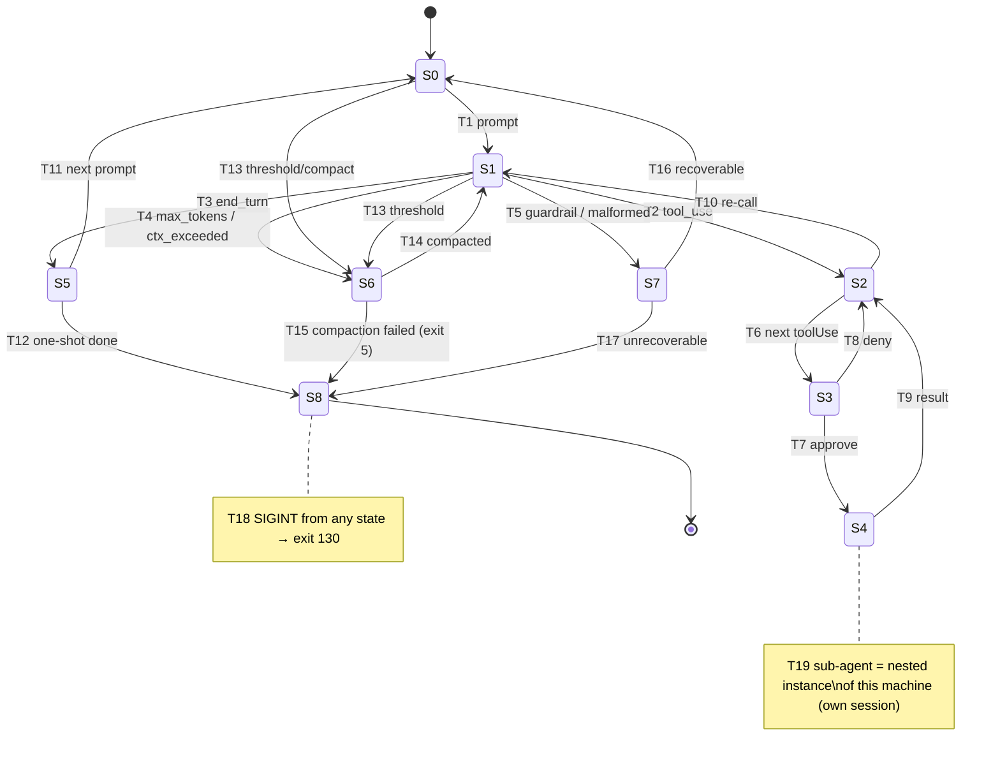
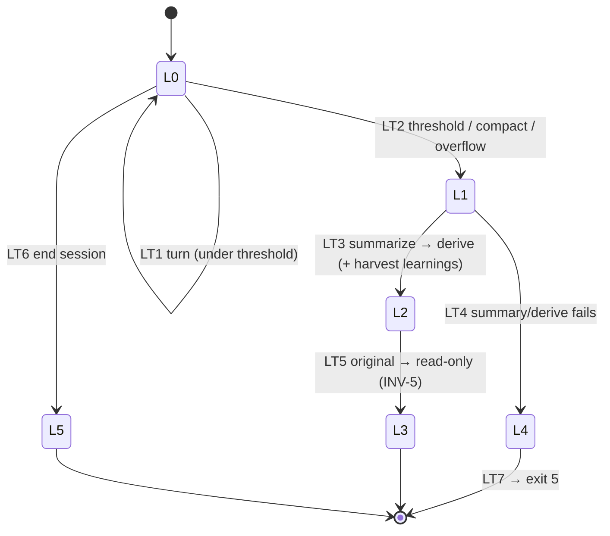

# State Machines — Authoritative Contract

> **Phase 3.** Two formal state machines: (A) the **agent loop**, driven by the Converse `stopReason`; (B) the **conversation/compaction lifecycle**, promoted from `03-data-model.md` § 6. Numbered states (`S*`) and transitions (`T*`) so contract tests and code can reference them. Sources: `02-architecture.md` § 2–3 (loop + failure matrices), `03-data-model.md` § 6 + INV-*, `design-progress.md` § 6.A.1 (verified `stopReason` set).

## A. Agent loop state machine

The heartbeat (C2). One in-flight Converse call per conversation (INV — single-threaded per conversation). The loop is selected by `stopReason`.

### States

| State | Meaning |
|-------|---------|
| **S0 Idle** | awaiting user input (REPL prompt) or the one-shot prompt |
| **S1 AwaitingModel** | a `Converse`/`ConverseStream` request is in flight |
| **S2 RoutingTools** | response had `stopReason: tool_use`; iterating its `toolUse` blocks |
| **S3 Gating** | a specific `toolUse` is at the permission gate (approve/deny) |
| **S4 ExecutingTool** | an approved tool handler is running (file/exec/web/subagent/memory) |
| **S5 Rendering** | `stopReason: end_turn`; final text shown to the user |
| **S6 Compacting** | budget threshold / overflow hit → hand to lifecycle machine B |
| **S7 Surfacing** | a condition is surfaced to the user (guardrail/malformed/verify-exhausted/error) |
| **S8 Terminating** | process winding down → an exit code |

### Transitions

| T | From → To | Trigger / guard | Side effects (events) |
|---|-----------|-----------------|-----------------------|
| T1 | S0 → S1 | user/one-shot prompt | append `USER_MESSAGE`; (check budget → maybe T13) |
| T2 | S1 → S2 | response `stopReason == tool_use` | append `MODEL_RESPONSE`, `MODEL_USAGE` |
| T3 | S1 → S5 | `stopReason == end_turn` | append `MODEL_RESPONSE`, `MODEL_USAGE` |
| T4 | S1 → S6 | `stopReason == max_tokens` (continuation) **or** `model_context_window_exceeded` | — |
| T5 | S1 → S7 | `stopReason ∈ {guardrail_intervened, content_filtered, malformed_*}` | surface; bounded repair-retry for `malformed_*` |
| T6 | S2 → S3 | next `toolUse` block | — |
| T7 | S3 → S4 | gate **approve** (auto for Class R; denylist always prompts) | append `PERMISSION_DECISION(approve)` |
| T8 | S3 → S2 | gate **deny** | append `PERMISSION_DECISION(deny)`, `TOOL_RESULT(denied)`; loop continues with denial result |
| T9 | S4 → S2 | tool handler returns (incl. error) | append `TOOL_RESULT` (disposal if > cap) |
| T10 | S2 → S1 | all `toolUse` blocks of this response handled | append the batched `toolResult`s as one user message; re-call |
| T11 | S5 → S0 | interactive; await next prompt | — |
| T12 | S5 → S8 | one-shot complete | → exit 0 |
| T13 | S1/S0 → S6 | `usage.inputTokens ≥ 0.85×window` **or** `/compact` | → machine B |
| T14 | S6 → S1 | compaction succeeded (machine B → Derived) | continue in the derived conversation |
| T15 | S6 → S8 | compaction failed (machine B → Failed) | → exit 5 |
| T16 | S7 → S0 | recoverable surface; user decides next | — |
| T17 | S7 → S8 | unrecoverable / blocking denial | → exit 3 (denial) / 4 (model) / 1 (internal) |
| T18 | any → S8 | SIGINT | cancel in-flight stream/subprocess; flush; → exit 130 |
| T19 | S4 → S4 | sub-agent runs its own nested instance of this machine | child session; parent gets summary (T9) |

### Invariants enforced by this machine

- **INV-2** (log-before-act): every state that has a side effect appends + flushes its event before the transition completes.
- **INV-8** (gate-before-side-effect): no path reaches S4 (ExecutingTool) without passing S3 (Gating) and a `PERMISSION_DECISION`.
- **INV-6** (toolUse/toolResult pairing): every T9 `TOOL_RESULT.toolUseId` matches the T6/T7 `toolUse`.
- **INV-7** (reasoning replay): S1 requests replay prior `ReasoningBlock`s verbatim with signatures.

## B. Conversation / compaction lifecycle

Promoted from `03-data-model.md` § 6. Governs a single conversation's life and the compaction-with-derivation transition (ADR-0006). Enforces INV-4 (derive, don't mutate) and INV-5 (original preserved).

### States

| State | Meaning |
|-------|---------|
| **L0 Active** | normal operation; events appending; machine A running against it |
| **L1 Compacting** | summary model-call in flight; **no in-place mutation** (INV-4) |
| **L2 Derived** | a new session created (`edgeType = DERIVED_FROM`); work continues there |
| **L3 ArchivedOriginal** | the pre-compaction conversation, now read-only, preserved (INV-5) |
| **L4 Failed** | summary/derive could not recover context |
| **L5 Closed** | session ended normally |

### Transitions

| T | From → To | Trigger / guard | Side effects |
|---|-----------|-----------------|--------------|
| LT1 | L0 → L0 | a turn completes, `usage < threshold` | events append |
| LT2 | L0 → L1 | `usage ≥ 0.85×window` **or** `/compact` **or** `model_context_window_exceeded` | begin summary call |
| LT3 | L1 → L2 | summary produced → new session seeded (summary + recent-tail) | append `COMPACTION(from,to,summaryRef)`; **propose harvested learnings** (AC-18.5) |
| LT4 | L1 → L4 | summary/derive fails | append `ERROR` |
| LT5 | L2 → (orig)L3 | derivation done | original conversation becomes read-only lineage node (INV-5) |
| LT6 | L0 → L5 | session ends cleanly | — |
| LT7 | L4 → (exit) | unrecoverable | → machine A T15 → exit 5 |

### Notes

- **Sub-agent conversations** are their own instances of this lifecycle (`edgeType = SPAWNED_BY` instead of `DERIVED_FROM`); they typically go L0 → L5 without compaction given their bounded scope.
- **Resume** (AC-7.2/7.4) re-enters at **L0** by replaying the chosen session's events; for a compacted lineage, the latest `DERIVED_FROM` continuation is the default resume target.

## C. Traceability

| Machine element | Source |
|-----------------|--------|
| A states/transitions | `02-architecture.md` § 2 (loop), § 3.1 (stopReason→action) |
| `stopReason` values | `design-progress.md` § 6.A.1 (verified) |
| A INV refs | `03-data-model.md` § 5 (INV-2/6/7/8) |
| B lifecycle | `03-data-model.md` § 6; ADR-0006; INV-4/5 |
| exit 5 path | `cli-exit-codes.md` (CONTEXT_EXHAUSTED) |

Contract tests referencing these states/transitions are indexed in `contract-tests.md` (batch 2).
