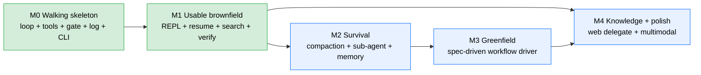

# Tasks — codingAgent

> **Phase 4 (final design phase).** Milestones + task breakdown that the Phase 5 coordinator drives to code. Tasks map to components (C1–C17, `02-architecture.md` § 1.2), cite AC/INV/ADR refs, and their verification gates reference contract tests (CT-*, `06-formal/contract-tests.md`). Milestone order follows the brainstorm staging (`design-progress.md` § 6.G): the brownfield engine spine first, then the survival mechanisms, then greenfield and delegation. Sizes: **S** ≤ ~½ day, **M** ~1–2 days, **L** ~3–5 days (rough, for sequencing not estimation).

## 1. Milestones

| M | Goal | Gate (done when) | Size |
|---|------|------------------|------|
| **M0** | **Walking skeleton** — Bedrock Converse call + owned loop + 3 tools (read/write/run) + permission gate + event-log persistence + CLI one-shot. Brownfield only. | A one-shot prompt runs a tool-use cycle end-to-end against a (mocked in tests, real in manual) Bedrock, gated, logged to JSONL. | L |
| **M1** | **Usable brownfield** — REPL, resume, agentic search (grep/glob/list/edit), build/test verify loop, output disposal. | Brownfield is genuinely useful: explore a repo, make a change, verify via `mvn test`, resume a session. | L |
| **M2** | **Survival** — compaction-with-derivation, sub-agent (in-process, N=1), two-tier curated memory. | A long task compacts + continues; a sub-agent returns a summary; a learning is proposed→approved→recalled. | L |
| **M3** | **Greenfield** — the full spec-driven workflow driver (phases + gates + artifacts). | A new project goes idea→requirements→design→tasks→implement, gated per phase, artifacts written to the target repo. | L |
| **M4** | **Knowledge + polish** — web delegate (headless claude), multimodal attachments, capability profiles for non-default models, config polish. | Web lookup works (delegate present); image/PDF attach works; model swap by config. | M |

M4 depends on M1 (tools + loop) for the delegate/attachment plumbing but not on M2/M3; it can run in parallel with M2/M3 or after — the coordinator sequences by dependency.

## 2. Tasks by milestone

Component refs are `C*` (`02-architecture.md` § 1.2). Deps are task ids. Gate column names the contract tests / ACs that should pass.

### M0 — Walking skeleton

| Task | Title | Component | Refs | Size | Deps | Verify |
|------|-------|-----------|------|------|------|--------|
| T-0.1 | Project skeleton: Maven, Java 21, `com.srk.codingagent` packages, JUnit 5, shaded-jar build | — | NFR-PLAT-*, 05 §1 | S | — | `mvn clean verify` runs; empty CLI launches |
| T-0.2 | Config model + resolver (layered precedence, fail-fast exit 2) | C17 | ADR-0009, AC-8.1/8.2/8.5 | M | T-0.1 | CT-SCH-13/14, CT-EX-1 |
| T-0.3 | Credential resolution (profile → default chain; ignore bearer; SigV4 client) | C4 | ADR-0011, AC-8.6/8.7/8.8/8.9, INV-16 | M | T-0.2 | CT-INV-13, CT-EX-2 |
| T-0.4 | Event log + session store (JSONL append, flush-per-event, ids/ts at boundary) | C14, C15 | ADR-0005, AC-13.1/13.3, INV-1/2 | M | T-0.1 | CT-SCH-1/2/3/4, CT-INV-1 |
| T-0.5 | Model Client: Converse request/response + wire-format mapping (text/toolUse/toolResult blocks) | C4 | ADR-0001, 03 §7, §6.A.1 | L | T-0.3 | CT-INV-5 (pairing); mocked-Bedrock unit tests |
| T-0.6 | Tool registry + 3 tools: `read_file`, `write_file`, `run_command` (+ CommandResult, tree-kill timeout) | C7, C9, C10 | ADR-0001/0003, AC-5.2/20.2, RD-10 | L | T-0.5 | CT-SCH-9/10, CT-INV-14 |
| T-0.7 | Permission gate: 4 modes, Class R/X, destructive denylist, grant matching (RD-1) | C8 | ADR-0004, AC-9.*/10.*, INV-8/9/10 | L | T-0.6 | CT-INV-7/8/9, CT-SM-2 |
| T-0.8 | Agent loop: stopReason dispatch (tool_use↔end_turn), log-before-act | C2 | ADR-0001, 02 §2, state-machine A | L | T-0.6, T-0.7 | CT-SM-1, CT-INV-2 |
| T-0.9 | CLI one-shot (`-p`), exit codes, SIGINT→130 | C1 | ADR-0009, 04 §1, cli-exit-codes | M | T-0.8 | CT-EX-3/4/6 |

### M1 — Usable brownfield

| Task | Title | Component | Refs | Size | Deps | Verify |
|------|-------|-----------|------|------|------|--------|
| T-1.1 | REPL: interactive loop, streaming output, inline approval prompts, slash-commands (`/exit`,`/mode`,`/permission`) | C1 | 04 §1.1/1.4, AC-10.1 | M | T-0.9 | manual REPL cycle; approval prompt shown |
| T-1.2 | Resume: list sessions, replay events → messages[], latest-continuation default | C15, C2 | AC-7.1/7.2/7.4, INV-1 | M | T-0.4, T-0.8 | CT-INV-3 (replay fidelity); `resume` lists+continues |
| T-1.3 | Search tools: `grep`, `glob`, `list`, `edit_file` | C9 | US-4/5, AC-4.1/4.4 | M | T-0.6 | edit applies; search finds; Class R non-gated |
| T-1.4 | Verify loop: run configured test cmd, react to exit, bounded retries (≤5) then surface | C2, C10 | US-20, AC-3.2/3.4/20.3/20.5, RD-10 | M | T-0.8 | CT-SM-5, CT-INV-14 |
| T-1.5 | Output disposal: head+tail truncation, full→log, retrieval | C6 | US-19, AC-19.1/19.2/19.3, NFR-OUTPUT-MAX-INLINE | M | T-0.4, T-0.6 | truncated flag set; full retrievable |
| T-1.6 | Brownfield workflow driver (understand→change orchestration over the loop) | C3 | US-4/5, ADR-0012 (brownfield side) | M | T-1.3, T-1.4 | explore→change→verify end-to-end |

### M2 — Survival

| Task | Title | Component | Refs | Size | Deps | Verify |
|------|-------|-----------|------|------|------|--------|
| T-2.1 | Token budget tracking + compaction trigger (0.85×window from capability profile) | C6, C5 | ADR-0006/0002, AC-18.1, NFR-CONTEXT-COMPACT-THRESHOLD | M | T-1.2 | threshold detected from measured usage |
| T-2.2 | Compaction-with-derivation: summary call, new derived session, original preserved | C6 | ADR-0006, AC-18.2/18.3/18.4, INV-4/5, state-machine B | L | T-2.1 | CT-SM-6/7, CT-INV-3/4 |
| T-2.3 | Sub-agent orchestrator (in-process, N=1, isolated context, budget, no inherited grants) | C13 | ADR-0010, AC-17.*, INV-10/11/12 | L | T-0.8 | CT-INV-9/10; summary-only propagation (INV-11) |
| T-2.4 | Memory store: two-tier markdown + index, read/write tools, re-read-fresh | C12, C16 | ADR-0007, AC-12.*/14.*, INV-13/14 | M | T-0.6 | CT-SCH-11/12, CT-INV-11/12 |
| T-2.5 | Memory propose-and-approve + compaction harvest (US-21 + AC-18.5) | C12, C6 | ADR-0007/0006, AC-21.*, INV-13 | M | T-2.2, T-2.4 | propose→approve→persist→recall; no auto-extract |
| T-2.6 | Outcome signals (success + iterations from test exit) | C14 | US-16, AC-16.*, RD-10 | S | T-1.4, T-0.4 | CT-SCH (OUTCOME), aggregatable |

### M3 — Greenfield (full spec-driven)

| Task | Title | Component | Refs | Size | Deps | Verify |
|------|-------|-----------|------|------|------|--------|
| T-3.1 | Greenfield driver: phase state machine (requirements→design→tasks→implement) + per-phase approval gates. **Multi-turn phase dialogue (DCR-2):** each pre-approval phase is a multi-turn conversation (the phase transcript carries across turns *within* the phase, so the model sees its own prior turns); the approval prompt is offered each round and **approve = finalize** (advance + persist), while a non-approve answer keeps the phase conversation going (another refining turn — also the AC-2.4 revise path), not persist-and-stop. | C3 | ADR-0012, US-1/2/3, AC-1.1/1.3/2.3/2.4 | L | T-1.6, T-2.4 | **phase-gating CT** (fills §6 gap); multi-turn phase converges before finalize; no source write across any pre-approval turn (AC-1.4) |
| T-3.2 | Artifact authoring: requirements/design/tasks markdown into the target repo, approval timestamps. **Driver-authored persistence (DCR-1) + approve-to-finalize capture (DCR-2):** the driver writes each phase artifact in code via `GreenfieldArtifactStore.write()`, not via a model `write_artifact` tool call; the capture-and-persist trigger is **phase approval** (DCR-2), so the *converged* multi-turn deliverable is written (not a single-turn first draft); later phases inject approved earlier artifacts into their conversation; AC-1.4 design/-confinement preserved (source-write tools withheld every turn). **Output-token budget (DCR-2, D1 follow-on):** set `inferenceConfig.maxTokens = 16384` (configurable) on the greenfield Converse request so a large deliverable is not truncated at the default 4096 cap. **Clobber protection (DCR-3, D13):** `GreenfieldArtifactStore.write()` refuses to truncate an already-approval-stamped artifact (`ApprovedArtifactProtectedException`) — the AC-1.5 stamp protects the approved deliverable and (per T-3.4) marks the phase resumable. | C3, C4 | RD-7, AC-1.1/1.2/1.4/1.5/2.1/2.3/2.4/2.5, ADR-0012 | M | T-3.1 | artifacts written (driver-guaranteed, captured at approval from the converged dialogue); no MAX_TOKENS truncation of a full deliverable; traceability AC→task verified against the written tasks artifact; a stamped artifact is not silently clobbered by a fresh run |
| T-3.3 | Greenfield implement loop: one task at a time, verify each before next (over the breakdown converged + approved via the multi-turn phase dialogue, DCR-2) | C3, C2 | US-3, AC-3.1/3.3 | M | T-3.1, T-1.4 | tasks done in order, each verified |
| T-3.4 | **Greenfield mid-flow resume + AC-7.3 repo-keying-forward (DCR-3).** On greenfield session start, reconstruct phase-state from the target repo's on-disk artifacts — an AC-1.5-stamped phase artifact = approved; resume at the first unstamped/absent phase rather than restarting at requirements; a transient mid-phase failure left the failed phase unstamped, so it is retryable in place. Bring the real AC-7.3 repo-keying forward (git remote URL else normalized abs path, ADR-0005) to scope the resumable session, **replacing the `Main.ONE_SHOT_LINEAGE` M0 placeholder** (the run-collision root cause). The AC-1.5 stamp is both the resume marker and the D13 clobber-protection signal (one durable on-disk fact). In-phase transcript is not preserved across an interruption (resume at phase boundary, re-converse — accepted tradeoff). | C3, C15 | AC-7.6, AC-7.3, ADR-0012, ADR-0005, US-1/2/7 | M | T-3.2 | CT-GF-1 (resume at design over a stamped requirements artifact, no restart), CT-GF-2 (no-clobber of a stamped artifact); a fresh greenfield run over a project keyed to its real repo key resumes at the first unstamped phase |
| T-3.5 | **Align the greenfield playbook prompts to the strict traceability gate's vocabulary (DCR-5).** Constrain the `GreenfieldPlaybook` per-phase prompt (C3) so it **emits** the gate's vocabulary: the **REQUIREMENTS** phase block directs the model to author acceptance criteria as numbered `AC-<n>.<m>` symbols, user stories as `US-<n>`, and NFRs as `NFR-<NAME>` (the gate-recognizable requirement-symbol shapes); the **TASKS** phase block directs the model to give each task a stable id of the form `T-<n>` / `T-<n>.<m>` (hyphen mandatory) with each task line citing ≥ 1 requirement symbol authored in the requirements phase. **No change to `TaskTraceability`** — the gate stays strict (DCR-5 Option a; relaxing the regexes was Option b, rejected). Add regression tests pinning the exact live-failing forms (hyphen-less `T1`/`T2`/`T10` ids citing `R1`–`R6` refs → strict gate refuses; gate-vocabulary `T-<n>` ids citing `AC-<n>.<m>`/`US-<n>`/`NFR-<NAME>` → pass), the class of defect the existing `TaskTraceabilityTest` could not catch by construction. | C3 | AC-2.5, AC-2.2, ADR-0012, US-1/2/3, `GreenfieldPlaybook` (C3 per-phase prompt) | S | T-3.2 | the prompt emits `AC-<n>.<m>`/`US-<n>`/`NFR-<NAME>` in the requirements phase + `T-<n>` ids citing them in the tasks phase; a regression test feeds the prior live-failing `T1`/`R5` forms and asserts the strict gate refuses them, and feeds gate-vocabulary forms and asserts it passes (no `TaskTraceability` regex change) |
| T-3.6 | **Tighten `write_artifact` containment to the known design-doc artifacts (DCR-6).** Restrict `GreenfieldArtifactStore`/`WriteArtifactTool` (C9, with C3) to **ONLY** the three known design-doc artifacts (`design/00-requirements.md`, `design/01-design.md`, `design/02-tasks.md`) — **reject any source path under `design/`** (e.g. `design/impl/pom.xml`, `design/impl/src/**`), closing the AC-1.4 pre-approval source-write hole the bare `resolved.startsWith(<workspaceRoot>/design)` check left open. No contract change — this tightens an existing confinement to match the class Javadocs ("cannot write source files") + AC-1.4. | C9, C3 | AC-1.4, RD-7, ADR-0012, `GreenfieldArtifactStore`/`WriteArtifactTool` | S | T-3.2 | CT-GF-4 (`design/impl/pom.xml` REJECTED; a source file under `design/impl/src/**` REJECTED; a bare source path REJECTED [already]; the three real artifacts `design/00-requirements.md`/`design/01-design.md`/`design/02-tasks.md` ALLOWED) |
| T-3.7 | **Harden `TaskTraceability` against real-breakdown miscounting + extend the greenfield TASKS prompt (DCR-6).** **(gate)** dedup repeated ids; skip arrow/sequencing-diagram lines (`T-1 -> T-2`); expand range headings (`T-3 through T-8` → `T-3..T-8`, each individually recognized and correctly flagged if untraced, not silently collapsed); recognize bold-wrapped ids in table rows (`\| **T-1** \|`) — recognition **COVERAGE only, NO strictness relaxation, NO loose block scan** (DCR-5 Option b stays rejected; the same-line-ref rule holds). **(prompt)** force a single canonical single-line task row per task and forbid range headings / multi-line `**Refs:**` blocks / arrow-diagram-as-task-list. Regression tests for all four failing shapes + a full Sonnet-style breakdown that now passes + a `GreenfieldPlaybook` test asserting the prompt forbids ranges/multi-line/arrows and names the single-line row format. | C3 | AC-2.2, AC-2.5, ADR-0012 (DCR-6), `GreenfieldPlaybook`, `TaskTraceability` | S | T-3.5 | CT-GF-3 (the four miscounting shapes — multi-line `**Refs:**` / range heading / arrow diagram / bold table cell — each correctly counted/flagged + a full Sonnet-style breakdown that now passes) |
| T-3.8 | **Greenfield implement-loop rework — verify-at-end / mark-complete-on-implementation (DCR-7, resolves D3).** Rework `GreenfieldImplementLoop` to implement **every** task in breakdown order and **mark each task complete AS IT IS IMPLEMENTED** (a durable on-disk completion marker via the reused `GreenfieldArtifactStore`), then **REMOVE verification from the per-task path**: DROP the per-task EXHAUSTED hard-stop (`GreenfieldImplementLoop` :178-183) and the per-task `NO_TEST_COMMAND` early-return (:184-188). End-of-phase verification (T-3.9) gates the phase, not each task; a task that is not independently testable (e.g. an early scaffold, a not-yet-buildable `pom.xml`) is implemented without a per-task verify. No more per-task verify cycle in the loop body. | C3, C2 | AC-3.2, AC-3.3, ADR-0012 (DCR-7), US-3 | M | T-3.3 | CT-GF-8 (scaffold-first breakdown — `T-1` scaffold, `T-2` pom — implements **all** tasks then verifies at end, **no hard-stop at `T-1`**) |
| T-3.9 | **End-of-phase / testable-only verification + no-test-command TERMINAL behavior (DCR-7, resolves D1).** Run the configured build/test **once at the end of the phase** (after the last task); on failure → bounded retry (`NFR-VERIFY-MAX-ITERATIONS`) then **stop-and-surface** (AC-3.4/AC-20.5). With **no configured test command** → skip the end verify with **ONE warning** and **terminate the phase deterministically** (AC-3.6) — a **complete-with-warning** terminal outcome (exit 0, no re-prompt loop). **FIX the AC-20.6 mis-citation** at `VerifyLoop.java:129`, `GreenfieldImplementLoop.java:186` & `:281` → cite **AC-3.6** (AC-20.6 is "prefer named commands", not the no-test-command behavior). Ensure `GreenfieldDriver.runImplementPhase` + `ReplRunner` keep-alive map the terminal no-test outcome so it does **NOT** re-prompt into a `T-1` redo (kills the livelock). Brownfield no-test sites (`BrownfieldDriver`) are OUT of scope. | C3, C2 | AC-3.2, AC-3.6, AC-20.5, NFR-VERIFY-MAX-ITERATIONS, ADR-0012 (DCR-7), US-3 | M | T-3.8 | CT-GF-5 (no-test-command terminates cleanly — all tasks implemented + marked complete, end verify skipped with warning, terminal, no re-loop) + CT-GF-7 (end-verify failure retries bounded then stop-and-surface) |
| T-3.10 | **Intra-IMPLEMENT resume skips completed tasks (DCR-7, resolves D2).** On a greenfield re-entry whose reconstructed phase is IMPLEMENT, **read back the per-task completion markers** (T-3.8's durable marker); `TaskTraceability.tasksInOrder()` / the implement loop **skip completed tasks** and resume at the **first incomplete task**, terminating instead of restarting at the first task (`T-1`). Extend the greenfield resume contract per AC-7.6 (the IMPLEMENT-phase facet). `markComplete` becomes both write **and** read (the prior write-only marker is now read back). | C3, C15 | AC-7.6, AC-3.3, ADR-0012 (DCR-7), US-1, US-2, US-3, US-7 | M | T-3.9 | CT-GF-6 (re-entry over a partially-completed breakdown resumes at the first incomplete task + terminates; does **not** restart at `T-1`) |

### M4 — Knowledge + polish

| Task | Title | Component | Refs | Size | Deps | Verify |
|------|-------|-----------|------|------|------|--------|
| T-4.1 | Web delegate: `web_search`/`web_fetch` via constrained `claude -p`, swappable backend, denied in READ_ONLY | C11 | ADR-0008, US-11, AC-11.*, RD-6 | M | T-0.7, T-1.1 | lookup returns text; absent→graceful; CT (Class X gating) |
| T-4.2 | Multimodal attachments: `--attach`/`/attach` → Image/Document blocks, sanitized name, capability-gated | C1, C4 | 03 §2.3, INV-18/19, AC (multimodal) | M | T-0.5, T-1.1 | CT-SCH-5/6/7/8, CT-INV-15/16 |
| T-4.3 | Capability profiles: registry, feature detection, graceful degradation; non-default model swap | C5 | ADR-0002, NFR-MODEL-PROVIDER, OQ-J | M | T-0.5 | CT-SCH-15; degrade when capability absent |
| T-4.4 | Prompt-cache placement (cachePoint after tools→system→memory-index, capability-gated) | C6, C4 | ADR-0006, OQ-I | S | T-2.4, T-4.3 | cache write/read tokens observed (manual) |
| T-4.5 | `sessions`/`memory`/`config` subcommands; `--debug`; SLF4J log levels | C1 | 04 §1.2, 05 §3 | S | T-1.1, T-2.4 | subcommands list/show/edit; levels tunable |
| T-4.6 | **Wire `NFR-BEDROCK-CALL-TIMEOUT` into the Bedrock client (DCR-4).** Construct the `BedrockRuntimeClient` (in `BedrockClientFactory`) with `apiCallTimeout` = the response budget and an Apache `httpClientBuilder` (`software.amazon.awssdk:apache-client`) whose `socketTimeout` = response budget / `connectionTimeout` = connect budget; read both from `ResolvedConfig` (new keys `bedrockCallResponseTimeoutSeconds` default 300, `bedrockCallConnectTimeoutSeconds` default 10, min 1, configurable). Add the two `ConfigKeys` + `ConfigDefaults` entries. Extend the `BedrockClientFactory.wiring(...)` seam so a CT-INV-13-style SUT-not-mocked wiring test can inspect the configured timeouts (no live Bedrock call). | C4 | NFR-BEDROCK-CALL-TIMEOUT, ADR-0001, AC-8.10/8.11, CT-SCH-16/17, 02 §2 | S | T-0.3 | CT-SCH-16 (timeout keys validate) + CT-SCH-17 (defaults applied when keys absent); wiring test asserts apiCall/socket = 300 s, connect = 10 s by default and overrides from config |

## 3. Cross-milestone verification gates

| Gate | After | Boolean-checkable criteria |
|------|-------|----------------------------|
| **G0** | M0 | One-shot tool-use cycle works end-to-end; gated; JSONL written; exit codes correct. CT-SCH-1..4/9/10/13/14, CT-INV-1/7/8/9, CT-EX-1/2/3/4/6 green. |
| **G1** | M1 | Brownfield usable: explore→edit→verify→resume. CT-SM-1/2/5, CT-INV-2/3/14 green. |
| **G2** | M2 | Survives long tasks: compaction + sub-agent + memory. CT-SM-6/7, CT-INV-3/4/9/10/11/12, CT-SCH-11/12 green. |
| **G3** | M3 | Greenfield end-to-end with phase gates; greenfield-phase-gating CT green (closes §6 gap); CT-GF-1 (mid-flow resume from stamped artifacts) + CT-GF-2 (no-clobber of a stamped artifact) green (DCR-3). |
| **G4** | M4 | Web lookup + multimodal + model swap. CT-SCH-5/6/7/8/15, CT-INV-15/16 green. Coverage gaps from `contract-tests.md` §6 closed. |

## 4. Risk register

| Risk | Likelihood × Impact | Mitigation |
|------|---------------------|------------|
| Converse streaming + toolUse partial-JSON assembly trickier than expected | M × M | T-0.5 isolates the wire boundary; mocked-Bedrock tests; the verified §6.A.1 facts pin the shapes |
| Process-tree kill / stream draining bugs (zombies, pipe deadlock) | M × M | T-0.6 dedicated; tests for timeout + large output; `ProcessHandle.descendants()` (Java 21) |
| Permission denylist tokenization unsound (quoting/escaping) | M × H | T-0.7; adversarial tests (CT-INV-8); conservative matching (over-prompt is safe) |
| Reasoning-signature replay breaks compaction if mishandled | L × H | INV-7 + CT-INV-6; compaction *derives* (never mutates) — INV-4 |
| single-agent topology misses drift on novel ground | M × M | switchable to three-agent mid-project via `agent_topology` (no migration); milestone gates catch issues early |
| Greenfield driver (M3) is large / over-ceremonious | M × M | it's a workflow-driver over the shared engine (reuses loop/tools/memory); sized as L; gates per phase |
| Headless-claude delegate availability/flag drift | L × L | optional prereq, graceful degradation (AC-11.3); swappable backend |

## 5. Out of scope for Phase 5 (v1 implementation)

Per `00-requirements.md` OOS + the ADRs: non-Claude provider *validation* (seam only), RL training, auto-memory-extraction, embeddings/RAG, multi-user/daemon, IDE/GUI, non-Java targets, MCP registry, container sandboxing, streaming/background long commands, Brazil packaging, image/video generation + video input, fork-based sub-agents (in-process only), N>1 sub-agent parallelism (config seam only).

## 6. Task → user-story mapping

| US | Tasks |
|----|-------|
| US-1/2/3 greenfield | T-3.1, T-3.2, T-3.3, T-3.4, T-3.5 (US-2 traceability-vocabulary alignment, AC-2.5/AC-2.2), T-3.6 (US-2 write_artifact AC-1.4 containment, DCR-6), T-3.7 (US-2 gate real-breakdown miscounting hardening + prompt, AC-2.2/AC-2.5, DCR-6), T-3.8 (US-3 implement-loop rework — verify-at-end / mark-complete-on-implementation, AC-3.2/AC-3.3, DCR-7), T-3.9 (US-3 end-of-phase/testable-only verify + no-test-command terminal, AC-3.2/AC-3.6, DCR-7), T-3.10 (US-3 intra-IMPLEMENT resume skips completed tasks, AC-7.6/AC-3.3, DCR-7) |
| US-4/5 brownfield | T-1.3, T-1.6, T-0.6 |
| US-6 CLI | T-0.9, T-1.1 |
| US-7 resume | T-1.2, T-3.4 (greenfield mid-flow resume, AC-7.6), T-3.10 (intra-IMPLEMENT resume skips completed tasks, AC-7.6, DCR-7) |
| US-8 configure | T-0.2, T-4.5, T-4.6 (Bedrock call timeout, AC-8.10/8.11) |
| US-9/10 permission | T-0.7 |
| US-11 web lookup | T-4.1 |
| US-12/14/21 memory | T-2.4, T-2.5 |
| US-13/15 observability | T-0.4, T-1.2, T-4.5 |
| US-16 outcomes | T-2.6 |
| US-17 sub-agents | T-2.3 |
| US-18 compaction | T-2.1, T-2.2 |
| US-19 output disposal | T-1.5 |
| US-20 self-verify | T-1.4 |
| multimodal input | T-4.2 |

## 7. Reading onward

- `.kiro/spec-driven.yaml` — the coordinator's config (written alongside this file at Phase 4 close).
- The coordinator picks the next unblocked task per milestone order, runs the configured topology (single-agent), commits + pushes per task, and stops at milestone gates G0–G4.
- All refs resolve to: `00-requirements.md` (US/AC/NFR/RD), `02-architecture.md` (C*), `adr/` (ADR-*), `06-formal/` (CT-*/INV via state-machine + contract-tests).
